# 클래스 다이어그램 & 도메인 모델

이커머스 시스템의 도메인 객체와 그들 간의 관계를 레이어드 아키텍처 관점에서 정의

## 도메인 모델링 개요

### Entity vs Value Object

- **Entity**: 고유 식별자를 가지며, 생명주기가 독립적인 객체 (동일성은 ID로 판단)
- **Value Object (VO)**: 식별자 없이 값으로만 구분되는 불변 객체 (동일성은 값으로 판단)

### Repository Interface 위치

- **Repository Interface는 Domain Layer에 위치**: 도메인이 필요로 하는 영속성 계약 정의
- **Repository 구현체는 Infrastructure Layer에 위치**: JPA 등 구체 기술로 구현

## 전체 도메인 모델

```mermaid
classDiagram
    class User {
        <<Entity>>
        +Long id
        +String name
        +String email
        +Gender gender
        +LocalDate birthDate
        +LocalDateTime createdAt
    }

    class Brand {
        <<Entity>>
        +Long id
        +String name
        +String description
        +LocalDateTime createdAt
    }

    class Product {
        <<Entity>>
        +Long id
        +String name
        +Price price
        +Brand brand
        +Long likeCount
        +LocalDateTime createdAt
        +checkStockAvailable(quantity) boolean
        ~setLikeCount(count) void
    }

    class Price {
        <<Value Object>>
        +BigDecimal amount
        +Currency currency
        +plus(Price) Price
        +minus(Price) Price
        +times(int) Price
        +compareTo(Price) int
    }

    class Stock {
        <<Entity>>
        +Long productId
        +int quantity
        +LocalDateTime createdAt
        +LocalDateTime updatedAt
        +decrease(int) void
        +increase(int) void
        +isAvailable(int) boolean
    }

    class Like {
        <<Entity>>
        +Long id
        +Long userId
        +Long productId
        +LocalDateTime createdAt
    }

    class Order {
        <<Entity, Aggregate Root>>
        +Long id
        +Long userId
        +List~OrderItem~ items
        +Money totalAmount
        +OrderStatus status
        +LocalDateTime orderedAt
        +calculateTotalAmount() Money
        +isOwnedBy(userId) boolean
        +confirm() void
        +cancel() void
    }

    class OrderItem {
        <<Entity>>
        +Long id
        +Long productId
        +String productName
        +Long brandId
        +String brandName
        +String brandDescription
        +int quantity
        +Price priceAtOrder
        +calculateItemAmount() Money
    }

    class Money {
        <<Value Object>>
        +BigDecimal amount
        +Currency currency
        +plus(Money) Money
        +minus(Money) Money
        +times(int) Money
        +unaryPlus() Money
        +unaryMinus() Money
        +isGreaterThanOrEqual(Money) Boolean
    }

    class Point {
        <<Entity>>
        +Long userId
        +Money balance
        +LocalDateTime createdAt
        +LocalDateTime updatedAt
        +charge(Money) void
        +deduct(Money) void
        +canDeduct(Money) boolean
    }

    class Coupon {
        <<Entity>>
        +Long id
        +String name
        +CouponType discountType
        +BigDecimal discountValue
        +LocalDateTime createdAt
        +LocalDateTime updatedAt
        +calculateDiscount(Money) Money
    }

    class UserCoupon {
        <<Entity>>
        +Long id
        +Long userId
        +Coupon coupon
        +boolean isUsed
        +LocalDateTime usedAt
        +LocalDateTime createdAt
        +LocalDateTime updatedAt
        +canUse() boolean
        +use() void
    }

    class CouponType {
        <<Enumeration>>
        FIXED_AMOUNT
        PERCENTAGE
    }

    class Payment {
        <<Entity>>
        +Long id
        +Long userId
        +Long orderId
        +Long amount
        +PaymentMethod paymentMethod
        +PaymentStatus status
        +String transactionKey
        +String cardType
        +String cardNo
        +String failureReason
        +LocalDateTime createdAt
        +LocalDateTime updatedAt
        +isCompleted() boolean
        +isFailed() boolean
        +isPending() boolean
        +isProcessing() boolean
        +complete() void
        +fail(reason) void
        +timeout() void
        +updateTransactionKey(key) void
    }

    class PaymentStatus {
        <<Enumeration>>
        PENDING
        PROCESSING
        COMPLETED
        FAILED
        TIMEOUT
    }

    class PaymentMethod {
        <<Enumeration>>
        POINT
        CARD
        MIXED
    }

    class OutboxEvent {
        <<Entity>>
        +Long id
        +String eventType
        +String topic
        +String partitionKey
        +String payload
        +String aggregateType
        +Long aggregateId
        +OutboxEventStatus status
        +int retryCount
        +LocalDateTime lastAttemptAt
        +String errorMessage
        +LocalDateTime publishedAt
        +markAsPublished() void
        +markAsFailed(errorMessage, maxRetryCount) void
        +canRetry(maxRetryCount) boolean
        +markAsProcessing() void
        +resetToPending() void
    }

    class OutboxEventStatus {
        <<Enumeration>>
        PENDING
        PROCESSING
        PUBLISHED
        FAILED
    }

    class EventHandled {
        <<Entity>>
        +Long id
        +String eventId
        +String eventType
        +String aggregateType
        +Long aggregateId
        +LocalDateTime handledAt
        +String handledBy
    }

    class ProductMetrics {
        <<Entity>>
        +Long id
        +Long productId
        +Long likeCount
        +Long viewCount
        +Long salesCount
        +Long totalSalesAmount
        +incrementLikeCount() void
        +decrementLikeCount() void
        +incrementViewCount() void
        +incrementSales(quantity, amount) void
        +decrementSales(quantity, amount) void
    }

    class Ranking {
        <<Value Object>>
        +Long productId
        +RankingScore score
        +Int rank
        +from(productId, score, rank) Ranking
    }

    class RankingKey {
        <<Value Object>>
        +RankingScope scope
        +TimeWindow window
        +LocalDateTime timestamp
        +toRedisKey() String
        +daily(scope, date) RankingKey
        +hourly(scope, dateTime) RankingKey
    }

    class RankingScore {
        <<Value Object>>
        +Double value
        +plus(RankingScore) RankingScore
        +times(Double) RankingScore
        +zero() RankingScore
        +sum(List) RankingScore
    }

    class RankingScope {
        <<Enumeration>>
        ALL
    }

    class TimeWindow {
        <<Enumeration>>
        DAILY
        HOURLY
    }

    class RankingRepository {
        <<Interface>>
        +incrementScore(key, productId, score) Double
        +incrementScoreBatch(key, scoreMap) void
        +getTopN(key, start, end) List~Ranking~
        +getRank(key, productId) Int?
        +getScore(key, productId) RankingScore?
        +getCount(key) Long
        +setExpire(key) void
        +copyWithWeight(sourceKey, targetKey, weight) void
    }

    class ProductRankDaily {
        <<Entity>>
        +Long id
        +LocalDate rankingDate
        +Long productId
        +Double score
        +Int rank
        +Long likeCount
        +Long viewCount
        +Long salesCount
    }

    class ProductRankWeekly {
        <<Entity>>
        +Long id
        +String yearWeek
        +Long productId
        +Double score
        +Int rank
        +LocalDate periodStart
        +LocalDate periodEnd
        +yearWeekToString(date) String
    }

    class ProductRankMonthly {
        <<Entity>>
        +Long id
        +String yearMonth
        +Long productId
        +Double score
        +Int rank
        +LocalDate periodStart
        +LocalDate periodEnd
        +yearMonthToString(yearMonth) String
        +stringToYearMonth(yearMonth) YearMonth
    }

    class ProductRankDailyRepository {
        <<Interface>>
        +save(entity) ProductRankDaily
        +saveAll(entities) List~ProductRankDaily~
        +deleteByRankingDate(date) void
        +findByRankingDateBetween(start, end) List~ProductRankDaily~
        +findByRankingDate(date) List~ProductRankDaily~
    }

    class ProductRankWeeklyRepository {
        <<Interface>>
        +save(entity) ProductRankWeekly
        +saveAll(entities) List~ProductRankWeekly~
        +deleteByYearWeek(yearWeek) void
        +findByYearWeek(yearWeek) List~ProductRankWeekly~
        +findTopByYearWeekOrderByRank(yearWeek, limit) List~ProductRankWeekly~
    }

    class ProductRankMonthlyRepository {
        <<Interface>>
        +save(entity) ProductRankMonthly
        +saveAll(entities) List~ProductRankMonthly~
        +deleteByYearMonth(yearMonth) void
        +findByYearMonth(yearMonth) List~ProductRankMonthly~
        +findTopByYearMonthOrderByRank(yearMonth, limit) List~ProductRankMonthly~
    }

    Ranking "1" --> "1" RankingScore : contains (VO)
    RankingKey "1" --> "1" RankingScope : has
    RankingKey "1" --> "1" TimeWindow : has
    RankingRepository ..> RankingKey : uses
    RankingRepository ..> Ranking : uses
    RankingRepository ..> RankingScore : uses
    ProductRankDailyRepository ..> ProductRankDaily : manages
    ProductRankWeeklyRepository ..> ProductRankWeekly : manages
    ProductRankMonthlyRepository ..> ProductRankMonthly : manages

    Brand "1" --> "*" Product : has
    Product "1" --> "1" Price : contains (VO)
    Product "1" --> "1" Stock : has
    Product "1" --> "1" ProductMetrics : has metrics
    Order "1" *-- "*" OrderItem : aggregates
    OrderItem "1" --> "1" Price : contains (VO)
    OrderItem "1" --> "1" Money : uses (VO)
    Order "1" --> "1" Money : contains (VO)
    Point "1" --> "1" Money : contains (VO)
    UserCoupon "*" --> "1" Coupon : references
    Coupon "1" --> "1" CouponType : has
    Payment "1" --> "1" Order : references
    Payment "1" --> "1" PaymentMethod : has
    Payment "1" --> "1" PaymentStatus : has
    Order "1" --> "1" PaymentMethod : has
    OutboxEvent "1" --> "1" OutboxEventStatus : has

    note for Order "Aggregate Root: OrderItem은 Order를 통해서만 접근"
    note for Price "Value Object: 불변, 식별자 없음"
    note for Money "Value Object: 불변, 식별자 없음"
    note for UserCoupon "사용자가 소유한 쿠폰, 1회 사용 제한"
    note for Payment "PG를 통한 카드 결제 정보 관리, 상태 전이 처리"
    note for OutboxEvent "Transactional Outbox Pattern: 도메인 이벤트를 DB에 저장 (commerce-api)"
    note for EventHandled "Idempotent Consumer Pattern: 이벤트 중복 처리 방지 (commerce-streamer)"
    note for ProductMetrics "이벤트 기반 실시간 집계: 상품별 메트릭 관리 (commerce-streamer)"
    note for Ranking "Redis ZSET 기반 랭킹 정보 (modules/redis)"
    note for RankingKey "시간 양자화를 통한 Redis 키 전략 (modules/redis)"
    note for RankingScore "랭킹 점수 기본 타입 (modules/redis)<br/>각 모듈은 RankingScoreCalculator로 확장"
    note for RankingRepository "랭킹 저장소 인터페이스 (modules/redis)<br/>RankingRedisRepository로 구현"
    note for ProductRankDaily "일간 랭킹 스냅샷 (modules/jpa)<br/>매일 23:55에 Redis TOP 1000 저장"
    note for ProductRankWeekly "주간 랭킹 집계 (modules/jpa)<br/>매주 일요일 01:00에 TOP 100 저장"
    note for ProductRankMonthly "월간 랭킹 집계 (modules/jpa)<br/>매월 1일 02:00에 TOP 100 저장"
```



## BaseEntity (대부분 엔티티의 기본 클래스)

### 소프트 삭제 (Soft Delete) 지원

대부분의 도메인 엔티티는 `BaseEntity`를 상속받아 공통 속성과 기능을 공유합니다.

**예외: Point와 Stock은 BaseEntity를 상속하지 않습니다** (이유는 아래 도메인 객체 상세 설명 참고)

**BaseEntity 속성:**
- `id`: 엔티티 고유 식별자 (Long)
- `createdAt`: 생성 일시 (LocalDateTime, @PrePersist로 자동 설정)
- `updatedAt`: 수정 일시 (LocalDateTime, @PreUpdate로 자동 갱신)
- `deletedAt`: 삭제 일시 (LocalDateTime?, null이면 삭제되지 않은 상태)

**BaseEntity 메서드:**
- `delete()`: 소프트 삭제 수행 (deletedAt 설정), 멱등적 (이미 삭제된 경우 무시)
- `restore()`: 삭제 복구 (deletedAt을 null로 설정), 멱등적
- `isDeleted()`: 삭제 여부 확인

**설계 포인트:**
- **물리적 삭제 대신 논리적 삭제**: 데이터 보존 및 이력 관리
- **멱등성**: `delete()`, `restore()` 메서드는 중복 호출 시에도 안전
- **조회 필터링**: 조회 시 `deletedAt IS NULL` 조건으로 삭제된 데이터 제외
- **삭제된 상품 필터링**: 좋아요 목록 조회 시 `findValidLikesByUserId()` 사용하여 삭제된 상품 제외

```kotlin
// modules/jpa/src/main/kotlin/com/loopers/domain/BaseEntity.kt
@MappedSuperclass
abstract class BaseEntity(
    @Id
    @GeneratedValue(strategy = GenerationType.IDENTITY)
    open val id: Long = 0,

    @CreationTimestamp
    @Column(nullable = false, updatable = false)
    open val createdAt: LocalDateTime = LocalDateTime.now(),

    @UpdateTimestamp
    @Column(nullable = false)
    open val updatedAt: LocalDateTime = LocalDateTime.now(),

    @Column(nullable = true)
    open var deletedAt: LocalDateTime? = null,
) {
    fun delete() {
        if (deletedAt == null) {
            deletedAt = LocalDateTime.now()
        }
    }

    fun restore() {
        deletedAt = null
    }

    fun isDeleted(): Boolean = deletedAt != null
}
```

## 도메인 객체 상세 설명

### 1. User (사용자)

- **책임**
  - 사용자 기본 정보 관리
  - 사용자 식별
- **속성**
  - `id`: 사용자 고유 식별자
  - `name`: 사용자 이름
  - `email`: 이메일 주소
  - `gender`: 성별 (enum)
  - `birthDate`: 생년월일
  - `createdAt`: 가입 일시
- **설계 포인트**
  - Entity (식별자 존재, 독립적 생명 주기)
  - 인증/인가는 구현하지 않음 (X-USER-ID 헤더 사용)

### 2. Brand (브랜드)

- **책임**
  - 브랜드 정보 관리
  - 소속 상품 관리
- **속성**
  - `id`: 브랜드 고유 식별자
  - `name`: 브랜드 이름
  - `description`: 브랜드 설명
  - `createdAt`: 등록 일시
- **메서드**
  - `getProducts()`: 해당 브랜드의 상품 목록 조회
- **설계 포인트**
  - Entity (식별자 존재)
  - Product와 1:N 관계

### 3. Product (상품)

- **책임**
  - 상품 기본 정보 관리
  - 재고 확인 로직
  - 브랜드 연관 관계
  - 좋아요 수 관리 (비정규화)
- **속성**
  - `id`: 상품 고유 식별자
  - `name`: 상품 이름
  - `price`: 상품 가격 (VO)
  - `brand`: 소속 브랜드
  - `likeCount`: 좋아요 수 (비정규화, Redis와 동기화)
  - `stock`: 재고 정보
  - `createdAt`: 등록 일시
- **메서드**
  - `checkStockAvailable(quantity)`: 요청 수량만큼 재고가 있는지 확인
  - `setLikeCount(count)`: 좋아요 수 직접 설정 (Redis-DB 동기화용, internal)
- **설계 포인트**
  - Entity (식별자 존재)
  - Brand와 N:1 관계 (단방향)
  - Price를 VO로 포함
  - Stock과 1:1 관계
  - **성능 최적화**: likeCount를 직접 보유하여 조회 성능 향상

### 4. Price (가격) - **Value Object**

- **타입**: Value Object (식별자 없음, 불변)
- **책임**
  - 금액 표현 및 계산
  - 통화 단위 관리
- **속성**
  - `amount`: 금액 (BigDecimal)
  - `currency`: 통화 (enum: KRW, USD 등)
- **메서드**
  - `plus(Price)`: 가격 더하기 (Kotlin 연산자 오버로드: `+`)
  - `minus(Price)`: 가격 빼기 (Kotlin 연산자 오버로드: `-`)
  - `times(int)`: 가격 곱하기 (Kotlin 연산자 오버로드: `*`)
  - `compareTo(Price)`: 가격 비교
- **설계 포인트**
  - **Value Object의 핵심**: 식별자가 없고, 값으로만 동일성을 판단
  - **불변성**: 모든 연산은 새로운 Price 객체 반환
  - **Kotlin 연산자 오버로드**: `operator fun plus()`, `operator fun times()` 등 사용
  - BigDecimal로 정확한 금액 계산
  - 통화 단위 포함하여 다국가 지원 가능
  - **도메인 무결성**: `init` 블록에서 음수 방지 검증

### 5. Stock (재고)

- **책임**
  - 상품 재고 관리
  - 재고 증감 로직
  - 재고 정합성 보장
- **속성**
  - `productId`: 상품 식별자 (PK, FK)
  - `quantity`: 재고 수량
  - `createdAt`: 생성 일시
  - `updatedAt`: 최근 갱신 일시
- **메서드**
  - `decrease(int)`: 재고 감소 (재고 부족 시 예외 발생)
  - `increase(int)`: 재고 증가
  - `isAvailable(int)`: 재고 확인
- **설계 포인트**
  - Entity (productId로 식별)
  - **BaseEntity 미상속 (Shared Primary Key 패턴)**
    - **이유 1**: FK(`productId`)를 PK로 직접 사용하므로 BaseEntity의 자동 생성 `id`와 충돌
    - **이유 2**: Product의 부속 데이터로 독립적인 생명주기가 없어 독립 ID 불필요
    - **이유 3**: Product 삭제 시 CASCADE로 함께 삭제되므로 Soft Delete 불필요
    - **이유 4**: PK 인덱스 하나로 충분하여 성능 최적화 (별도 UNIQUE 인덱스 불필요)
  - Product와 1:1 관계 (Aggregate: Product가 Root, Stock이 부속)
  - **동시성 제어**: 비관적 락(`SELECT FOR UPDATE`) 사용
    - 여러 사용자의 동시 주문 시 재고 정합성 확보
    - `decrease()` 메서드 호출 시 DB 행 잠금
    - 트랜잭션 내에서 재고 확인과 차감을 원자적으로 수행
  - **TOCTOU 방지**: 사전 검증(`isAvailable`)과 실제 차감(`decrease`)을 트랜잭션 내에서 처리

### 6. Like (좋아요)

- **책임**
  - 사용자의 상품 좋아요 관계 관리
- **속성**
  - `id`: 좋아요 고유 식별자
  - `user`: 좋아요한 사용자
  - `product`: 좋아요 대상 상품
  - `createdAt`: 좋아요 등록 일시
- **설계 포인트**
  - Entity (식별자 존재)
  - User와 N:1 관계
  - Product와 N:1 관계
  - 복합 유니크 제약: (userId, productId)

### 7. Order (주문)

- **책임**
  - 주문 정보 관리
  - 주문 총액 계산
  - 주문 상태 관리
- **속성**
  - `id`: 주문 고유 식별자
  - `user`: 주문한 사용자
  - `items`: 주문 항목 목록
  - `totalAmount`: 총 주문 금액
  - `status`: 주문 상태 (enum)
  - `orderedAt`: 주문 일시
- **메서드**
  - `calculateTotalAmount()`: 총 주문 금액 계산
  - `isOwnedBy(userId)`: 주문 소유자 확인
  - `confirm()`: 주문 상태를 CONFIRMED로 변경
  - `cancel()`: 주문 취소
- **설계 포인트**
  - Entity (식별자 존재)
  - Aggregate Root (OrderItem을 포함하는 집합체)
  - User와 N:1 관계
  - OrderItem과 1:N 관계 (Composition)

### 8. OrderItem (주문 항목)

- **책임**
  - 주문 내 개별 상품 정보 관리
  - 주문 시점의 상품 및 브랜드 정보 스냅샷 보존
- **속성**
  - `id`: 주문 항목 고유 식별자
  - `product`: 주문한 상품 (참조용)
  - `productName`: 주문 시점의 상품명 (스냅샷)
  - `brandId`: 주문 시점의 브랜드 ID (스냅샷)
  - `brandName`: 주문 시점의 브랜드명 (스냅샷)
  - `brandDescription`: 주문 시점의 브랜드 설명 (스냅샷)
  - `quantity`: 주문 수량
  - `priceAtOrder`: 주문 시점의 가격 (스냅샷)
- **메서드**
  - `calculateItemAmount()`: 항목별 금액 계산 (가격 × 수량)
- **설계 포인트**
  - Entity (식별자 존재)
  - Order의 일부 (독립적으로 존재 불가)
  - Product와 N:1 관계
  - 주문 시점의 상품명, 브랜드 정보(ID, 이름, 설명), 가격을 스냅샷으로 저장 (상품/브랜드 정보 변경에 영향받지 않음)

### 9. Money (금액) - **Value Object**

- **타입**: Value Object (식별자 없음, 불변)
- **책임**
  - 금액 표현 및 계산
  - 통화 단위 관리
- **속성**
  - `amount`: 금액 (BigDecimal)
  - `currency`: 통화 (enum: KRW, USD 등)
- **메서드**
  - `plus(Money)`: 금액 더하기 (Kotlin 연산자 오버로드: `+`)
  - `minus(Money)`: 금액 빼기 (Kotlin 연산자 오버로드: `-`)
  - `times(int)`: 금액 곱하기 (Kotlin 연산자 오버로드: `*`)
  - `unaryPlus()`: 단항 `+` 연산자
  - `unaryMinus()`: 단항 `-` 연산자 (부호 반전)
  - `isGreaterThanOrEqual(Money)`: 크거나 같은지 비교
- **설계 포인트**
  - **Value Object의 핵심**: 식별자가 없고, 값으로만 동일성을 판단
  - **불변성**: 모든 연산은 새로운 Money 객체 반환
  - **Kotlin 연산자 오버로드**: `operator fun plus()`, `operator fun times()`, `operator fun unaryMinus()` 등 사용
  - Price와 유사하지만 더 넓은 범위에서 사용 (주문 총액, 포인트 등)
  - **도메인 무결성**: `init` 블록에서 음수 방지 검증
  - **Kotlin의 inline value class** 사용 가능 (`@JvmInline value class`)

### 10. Point (포인트)

- **책임**
  - 사용자 포인트 관리
  - 포인트 충전 및 차감
- **속성**
  - `userId`: 사용자 식별자 (PK, FK)
  - `balance`: 보유 포인트 (Money)
  - `createdAt`: 생성 일시
  - `updatedAt`: 최근 갱신 일시
- **메서드**
  - `charge(Money)`: 포인트 충전
  - `deduct(Money)`: 포인트 차감
  - `canDeduct(Money)`: 차감 가능 여부 확인
- **설계 포인트**
  - Entity (userId로 식별)
  - **BaseEntity 미상속 (Shared Primary Key 패턴)**
    - **이유 1**: FK(`userId`)를 PK로 직접 사용하므로 BaseEntity의 자동 생성 `id`와 충돌
    - **이유 2**: User의 부속 데이터로 독립적인 생명주기가 없어 독립 ID 불필요
    - **이유 3**: User 삭제 시 CASCADE로 함께 삭제되므로 Soft Delete 불필요
    - **이유 4**: PK 인덱스 하나로 충분하여 성능 최적화 (별도 UNIQUE 인덱스 불필요)
  - User와 1:1 관계 (Aggregate: User가 Root, Point가 부속)
  - 동시성 제어 필요 (비관적 락 사용)

### 11. Coupon (쿠폰)

- **책임**
  - 쿠폰 기본 정보 관리
  - 할인 금액 계산
- **속성**
  - `id`: 쿠폰 식별자
  - `name`: 쿠폰 이름
  - `discountType`: 할인 타입 (CouponType)
  - `discountValue`: 할인 값 (정액: 금액, 정률: 퍼센트)
  - `createdAt`: 생성 일시
  - `updatedAt`: 수정 일시
- **메서드**
  - `calculateDiscount(Money)`: 주문 금액에 대한 할인 금액 계산
- **설계 포인트**
  - Entity (id로 식별)
  - CouponType enum을 통해 정액/정률 할인 구분
  - 할인 금액은 주문 금액을 초과할 수 없음

### 12. UserCoupon (사용자 쿠폰)

- **책임**
  - 사용자의 쿠폰 소유 관계 관리
  - 쿠폰 사용 상태 관리
- **속성**
  - `id`: 사용자 쿠폰 식별자
  - `userId`: 사용자 식별자
  - `coupon`: 쿠폰 엔티티 (참조)
  - `isUsed`: 사용 여부
  - `usedAt`: 사용 일시
  - `createdAt`: 발급 일시
  - `updatedAt`: 수정 일시
- **메서드**
  - `canUse()`: 사용 가능 여부 확인
  - `use()`: 쿠폰 사용 처리
- **설계 포인트**
  - Entity (id로 식별)
  - User와 N:1 관계 (한 사용자가 여러 쿠폰 소유 가능)
  - Coupon과 N:1 관계 (동일한 쿠폰을 여러 사용자가 소유 가능)
  - 1회만 사용 가능 (isUsed 플래그)
  - 동시성 제어 필요 (비관적 락 사용)

### 13. Payment (결제)

- **책임**
  - PG를 통한 카드 결제 정보 관리
  - 결제 상태 전이 처리
  - 결제 결과 추적
- **속성**
  - `id`: 결제 고유 식별자
  - `userId`: 사용자 식별자
  - `orderId`: 주문 식별자
  - `amount`: 결제 금액 (Long, 원화 단위)
  - `paymentMethod`: 결제 방식 (PaymentMethod: CARD)
  - `status`: 결제 상태 (PaymentStatus)
  - `transactionKey`: PG 거래 고유 키 (nullable)
  - `cardType`: 카드 종류 (SAMSUNG, SHINHAN 등, nullable)
  - `cardNo`: 카드 번호 (마스킹 처리, nullable)
  - `failureReason`: 실패 사유 (nullable)
  - `createdAt`: 결제 생성 일시
  - `updatedAt`: 결제 수정 일시
- **메서드**
  - `isCompleted()`: 결제 완료 여부 확인
  - `isFailed()`: 결제 실패 여부 확인
  - `isPending()`: 결제 대기 여부 확인
  - `isProcessing()`: 결제 처리 중 여부 확인
  - `complete()`: 결제를 COMPLETED 상태로 전이
  - `fail(reason)`: 결제를 FAILED 상태로 전이 (실패 사유 저장)
  - `timeout()`: 결제를 TIMEOUT 상태로 전이
  - `updateTransactionKey(key)`: PG 거래 키 업데이트
- **설계 포인트**
  - Entity (id로 식별)
  - Order와 1:1 관계 (한 주문당 하나의 결제)
  - **amount 타입**: Long (원화 단위, Money VO 미사용)
  - **비동기 결제 처리**: PENDING → PROCESSING → PG 요청 → 콜백 대기 → COMPLETED/FAILED
  - **멱등성**: 콜백 중복 처리 방지 (transactionKey 기반)
  - **상태 전이**: PENDING → PROCESSING → COMPLETED/FAILED/TIMEOUT
  - **타임아웃 처리**: 스케줄러가 10분 이상 PENDING 상태인 결제를 확인하여 TIMEOUT 처리
  - **실패 사유 추적**: failureReason 필드로 실패 원인 저장
  - **Resilience 패턴 적용**: PG 호출 시 Timeout, Retry, Circuit Breaker, Fallback 적용

### 14. OutboxEvent (Outbox 이벤트)

**애플리케이션**: commerce-api

- **책임**
  - Transactional Outbox Pattern 구현
  - 도메인 이벤트를 DB에 저장
  - Kafka 발행을 위한 이벤트 큐
- **속성**
  - `id`: Outbox 이벤트 고유 식별자
  - `eventType`: 이벤트 타입 (e.g. LikeAddedEvent, OrderCreatedEvent)
  - `topic`: Kafka 토픽명 (catalog-events, order-events)
  - `partitionKey`: 파티션 키 (순서 보장용: productId, orderId)
  - `payload`: 이벤트 페이로드 (JSON)
  - `aggregateType`: 집계 타입 (Product, Order, Like)
  - `aggregateId`: 집계 ID
  - `status`: 이벤트 상태 (OutboxEventStatus enum)
  - `retryCount`: 재시도 횟수
  - `lastAttemptAt`: 마지막 시도 시각
  - `errorMessage`: 에러 메시지
  - `publishedAt`: 발행 완료 시각
- **메서드**
  - `markAsPublished()`: 발행 성공 처리 (PUBLISHED 상태로 전이)
  - `markAsFailed(errorMessage, maxRetryCount)`: 발행 실패 처리 (재시도 횟수 초과 시 FAILED 상태)
  - `canRetry(maxRetryCount)`: 재시도 가능 여부 확인
  - `markAsProcessing()`: 처리 중 상태로 변경
  - `resetToPending()`: PENDING 상태로 복원
- **설계 포인트**
  - Entity (식별자 존재)
  - **Transactional Outbox Pattern**: 도메인 데이터 변경과 이벤트 저장을 하나의 트랜잭션으로 처리
  - **At Least Once 보장**: PENDING 이벤트를 주기적으로 폴링하여 Kafka로 발행
  - **순서 보장**: partitionKey로 같은 집계의 이벤트는 같은 파티션으로 전송
  - **재시도 로직**: 실패 시 retryCount 증가, 최대 재시도 횟수 초과 시 FAILED 상태
  - **별도 애플리케이션**: commerce-api에서만 사용

### 15. EventHandled (이벤트 처리 기록)

**애플리케이션**: commerce-streamer

- **책임**
  - Idempotent Consumer Pattern 구현
  - 이벤트 중복 처리 방지
  - 이벤트 처리 이력 관리
- **속성**
  - `id`: 처리 기록 고유 식별자
  - `eventId`: 이벤트 고유 ID (UUID)
  - `eventType`: 이벤트 타입 (e.g. LikeAddedEvent)
  - `aggregateType`: 집계 타입 (Product, Order)
  - `aggregateId`: 집계 ID
  - `handledAt`: 처리 완료 시각
  - `handledBy`: 처리자 (consumer group id: commerce-streamer)
- **설계 포인트**
  - Entity (식별자 존재)
  - **Idempotent Consumer Pattern**: 같은 이벤트를 여러 번 수신해도 한 번만 처리
  - **At Most Once 보장**: eventId UNIQUE 제약으로 중복 처리 방지
  - **빠른 중복 체크**: eventId 유니크 인덱스로 O(1) 조회
  - **장기 보관**: 멱등성 보장을 위해 장기 보관 (아카이빙 정책 필요)
  - **별도 애플리케이션**: commerce-streamer에서만 사용

### 16. ProductMetrics (상품 메트릭)

**애플리케이션**: commerce-streamer

- **책임**
  - 상품별 실시간 집계 메트릭 관리
  - 이벤트 기반 집계 처리
- **속성**
  - `id`: 메트릭 고유 식별자
  - `productId`: 상품 ID
  - `likeCount`: 좋아요 수
  - `viewCount`: 조회 수 (상세 페이지)
  - `salesCount`: 판매량 (주문 완료 기준)
  - `totalSalesAmount`: 총 판매 금액
- **메서드**
  - `incrementLikeCount()`: 좋아요 수 증가
  - `decrementLikeCount()`: 좋아요 수 감소
  - `incrementViewCount()`: 조회 수 증가
  - `incrementSales(quantity, amount)`: 판매량 및 판매 금액 증가
  - `decrementSales(quantity, amount)`: 판매량 및 판매 금액 감소 (주문 취소 시)
- **설계 포인트**
  - Entity (식별자 존재)
  - Product와 1:1 관계
  - **이벤트 기반 실시간 집계**: Consumer가 이벤트 수신 시 메트릭 업데이트
  - **도메인 로직 분리**: commerce-api의 도메인 로직과 집계 로직 완전 분리
  - **장애 격리**: 집계 실패해도 도메인 로직에 영향 없음
  - **확장 가능**: 추가 메트릭(평점, 리뷰 수 등) 쉽게 추가 가능
  - **별도 애플리케이션**: commerce-streamer에서만 사용

### 17. Ranking (랭킹 정보) - **Value Object**

**위치**: modules/redis (공유 모듈)

- **타입**: Value Object (식별자 없음)
- **책임**
  - Redis ZSET 기반 랭킹 정보 표현
  - 상품 ID, 점수, 순위를 하나의 불변 객체로 관리
- **속성**
  - `productId`: 상품 ID
  - `score`: 랭킹 점수 (RankingScore)
  - `rank`: 순위 (1부터 시작)
- **메서드**
  - `from(productId, score, rank)`: Redis ZSET 항목으로부터 Ranking 생성
- **설계 포인트**
  - **Value Object**: 식별자 없이 값으로 동일성 판단
  - **불변성**: 모든 속성이 불변
  - **공유 타입**: 모든 모듈에서 사용하는 공통 타입
  - **순위 검증**: init 블록에서 rank >= 1 검증

### 18. RankingKey (랭킹 키) - **Value Object**

**위치**: modules/redis (공유 모듈)

- **타입**: Value Object (식별자 없음)
- **책임**
  - Redis ZSET 키 생성 전략 구현
  - 시간 양자화(Time Quantization) 처리
- **속성**
  - `scope`: 랭킹 범위 (RankingScope)
  - `window`: 시간 윈도우 (TimeWindow)
  - `timestamp`: 시간 정보
- **메서드**
  - `toRedisKey()`: Redis 키 문자열 생성
  - `daily(scope, date)`: 일간 랭킹 키 생성
  - `hourly(scope, dateTime)`: 시간별 랭킹 키 생성
  - `currentDaily(scope)`: 현재 일간 랭킹 키
  - `currentHourly(scope)`: 현재 시간별 랭킹 키
- **설계 포인트**
  - **Value Object**: 불변 객체
  - **시간 양자화**: 시간 윈도우별로 키 분리하여 Long Tail 문제 해결
  - **TTL 관리**: TimeWindow enum에 ttlDays 포함
  - **공유 타입**: 모든 모듈에서 사용

### 19. RankingScore (랭킹 점수) - **Value Object**

**위치**: modules/redis (공유 모듈, 기본 타입)

- **타입**: Value Object (식별자 없음)
- **책임**
  - 랭킹 점수의 기본 타입 제공
  - 점수 연산 및 검증
- **속성**
  - `value`: 점수 값 (Double)
- **메서드**
  - `plus(RankingScore)`: 점수 더하기
  - `times(Double)`: 점수 곱하기 (배수는 0 이상이어야 함)
  - `zero()`: 0 점수 생성
  - `sum(List<RankingScore>)`: 여러 점수 합산
- **설계 포인트**
  - **Value Object**: 불변 객체
  - **공유 기본 타입**: 모든 모듈에서 사용하는 기본 타입
  - **모듈별 확장**: 각 모듈은 RankingScoreCalculator로 점수 계산 로직 구현
  - **검증**: init 블록에서 value >= 0 검증
  - **연산 안전성**: times() 메서드에서 negative multiplier 검증

### 20. RankingRepository (랭킹 저장소)

**위치**: modules/redis (공유 모듈, 인터페이스)

- **책임**
  - Redis ZSET 기반 랭킹 저장소 계약 정의
  - 랭킹 점수 증가 및 조회 인터페이스 제공
- **메서드**
  - `incrementScore(key, productId, score)`: 점수 증가 (ZINCRBY)
  - `incrementScoreBatch(key, scoreMap)`: 배치 점수 증가
  - `getTopN(key, start, end)`: Top-N 랭킹 조회 (ZREVRANGE)
  - `getRank(key, productId)`: 특정 상품 순위 조회 (ZREVRANK)
  - `getScore(key, productId)`: 특정 상품 점수 조회 (ZSCORE)
  - `getCount(key)`: 랭킹 항목 수 조회 (ZCARD)
  - `setExpire(key)`: TTL 설정
  - `copyWithWeight(sourceKey, targetKey, weight)`: 가중치 복사 (콜드 스타트 방지)
- **설계 포인트**
  - **Repository Interface는 Domain에 위치**: 공유 도메인 계약
  - **구현체는 modules/redis에 위치**: RankingRedisRepository
  - **Redis ZSET 기반**: 내부적으로 Redis ZSET 명령어 사용
  - **배치 처리 지원**: incrementScoreBatch로 성능 최적화

### 21. ProductRankDaily (일간 랭킹 영구 저장) - **Entity**

**위치**: modules/jpa (공유 엔티티)

- **타입**: Entity (식별자 있음)
- **책임**
  - Redis 랭킹 데이터의 일간 스냅샷 저장
  - 주간/월간 집계의 원본 데이터 제공
  - 상품별 메트릭 스냅샷 함께 저장
- **속성**
  - `id`: 엔티티 ID (Long, PK)
  - `rankingDate`: 랭킹 날짜 (LocalDate)
  - `productId`: 상품 ID
  - `score`: 랭킹 점수 (Double)
  - `rank`: 순위 (Int, 1부터 시작)
  - `likeCount`: 좋아요 수 스냅샷
  - `viewCount`: 조회 수 스냅샷
  - `salesCount`: 판매량 스냅샷
- **인덱스**
  - `uk_product_rank_daily_date_product`: (ranking_date, product_id) UNIQUE
  - `idx_product_rank_daily_date`: ranking_date DESC
  - `idx_product_rank_daily_date_rank`: (ranking_date, rank)
- **설계 포인트**
  - **Materialized View 역할**: Redis 데이터를 DB에 영구 저장
  - **TOP 1000만 저장**: 매일 23:55 스케줄러로 TOP 1000 저장
  - **멱등성**: deleteByRankingDate 후 저장으로 보장
  - **집계 원본 데이터**: 배치 Job의 ItemReader가 이 테이블 조회

### 22. ProductRankWeekly (주간 랭킹 집계) - **Entity**

**위치**: modules/jpa (공유 엔티티)

- **타입**: Entity (식별자 있음)
- **책임**
  - 주간 TOP 100 랭킹 집계 결과 저장
  - 일간 랭킹(ProductRankDaily)으로부터 주간 평균 계산
- **속성**
  - `id`: 엔티티 ID (Long, PK)
  - `yearWeek`: 연도-주차 (String, "2025W03")
  - `productId`: 상품 ID
  - `score`: 주간 평균 점수 (Double)
  - `rank`: 주간 순위 (Int)
  - `periodStart`: 집계 시작일 (LocalDate, 월요일)
  - `periodEnd`: 집계 종료일 (LocalDate, 일요일)
- **인덱스**
  - `uk_product_rank_weekly_year_week_product`: (year_week, product_id) UNIQUE
  - `idx_product_rank_weekly_year_week`: year_week DESC
  - `idx_product_rank_weekly_year_week_rank`: (year_week, rank)
- **설계 포인트**
  - **Materialized View**: 집계 결과를 미리 계산하여 저장
  - **TOP 100만 저장**: 배치 Job으로 매주 일요일 01:00에 집계
  - **평균 점수 기준**: 7일간 평균 점수로 순위 산정
  - **멱등성**: deleteByYearWeek 후 저장으로 보장

### 23. ProductRankMonthly (월간 랭킹 집계) - **Entity**

**위치**: modules/jpa (공유 엔티티)

- **타입**: Entity (식별자 있음)
- **책임**
  - 월간 TOP 100 랭킹 집계 결과 저장
  - 일간 랭킹(ProductRankDaily)으로부터 월간 평균 계산
- **속성**
  - `id`: 엔티티 ID (Long, PK)
  - `yearMonth`: 연도-월 (String, "202501")
  - `productId`: 상품 ID
  - `score`: 월간 평균 점수 (Double)
  - `rank`: 월간 순위 (Int)
  - `periodStart`: 집계 시작일 (LocalDate, 1일)
  - `periodEnd`: 집계 종료일 (LocalDate, 말일)
- **인덱스**
  - `uk_product_rank_monthly_year_month_product`: (year_month, product_id) UNIQUE
  - `idx_product_rank_monthly_year_month`: year_month DESC
  - `idx_product_rank_monthly_year_month_rank`: (year_month, rank)
- **설계 포인트**
  - **Materialized View**: 집계 결과를 미리 계산하여 저장
  - **TOP 100만 저장**: 배치 Job으로 매월 1일 02:00에 집계
  - **평균 점수 기준**: 한 달간 평균 점수로 순위 산정
  - **멱등성**: deleteByYearMonth 후 저장으로 보장
  - **yearMonth 검증**: init 블록에서 yyyyMM 형식 검증

## Enum 정의

### Gender (성별)

```kotlin
enum class Gender {
    MALE,
    FEMALE,
    OTHER
}
```

### Currency (통화)

```kotlin
enum class Currency {
    KRW,  // 한국 원
    USD   // 미국 달러
}
```

### OrderStatus (주문 상태)

```kotlin
enum class OrderStatus {
    PENDING,      // 대기 중
    CONFIRMED,    // 확인됨
    SHIPPED,      // 배송 중
    DELIVERED,    // 배송 완료
    CANCELLED     // 취소됨
}
```

### CouponType (쿠폰 할인 타입)

```kotlin
enum class CouponType {
    FIXED_AMOUNT,  // 정액 할인
    PERCENTAGE     // 정률 할인 (%)
}
```

### PaymentStatus (결제 상태)

```kotlin
enum class PaymentStatus {
    PENDING,      // 결제 대기 중 (생성 직후)
    PROCESSING,   // 결제 처리 중 (PG 요청 후 콜백 대기)
    COMPLETED,    // 결제 완료
    FAILED,       // 결제 실패
    TIMEOUT       // 결제 타임아웃 (10분 이상 응답 없음)
}
```

### PaymentMethod (결제 방식)

```kotlin
enum class PaymentMethod {
    POINT,   // 포인트 결제 (동기 처리)
    CARD,    // 카드 결제 (비동기 PG 처리)
    MIXED    // 혼합 결제 (향후 구현 예정)
}
```

### OutboxEventStatus (Outbox 이벤트 상태)

```kotlin
enum class OutboxEventStatus {
    PENDING,      // 발행 대기 중
    PROCESSING,   // 처리 중
    PUBLISHED,    // 발행 완료
    FAILED        // 발행 실패 (최대 재시도 횟수 초과)
}
```

## 연관 관계 정리

### 단방향 연관 관계

- Product → Brand: 상품은 자신이 속한 브랜드를 알아야 함
- Product → Stock: 상품은 자신의 재고를 알아야 함
- Like → User: 좋아요는 사용자를 알아야 함
- Like → Product: 좋아요는 상품을 알아야 함
- Order → User: 주문은 주문자를 알아야 함
- OrderItem → Product: 주문 항목은 상품을 알아야 함
- Point → User: 포인트는 소유자를 알아야 함
- UserCoupon → User: 사용자 쿠폰은 소유자를 알아야 함
- UserCoupon → Coupon: 사용자 쿠폰은 쿠폰 정보를 알아야 함
- Payment → Order: 결제는 주문을 참조함
- Order → PaymentMethod: 주문은 결제 방식을 알아야 함

### 양방향 연관 관계 최소화

- Brand ↔ Product: 필요시 양방향으로 확장 가능하나, 기본은 단방향
- Order → OrderItem: 주문이 항목을 포함 (Composition)

## 설계 원칙

### 1. Entity vs Value Object 구분

- **Entity**: 식별자가 있고 생명 주기가 독립적 (User, Product, Order 등)
- **Value Object**: 식별자가 없고 불변 (Price, Money 등)

### 2. Aggregate 설계

- **Order가 OrderItem의 Aggregate Root**
- OrderItem은 Order를 통해서만 접근
- 트랜잭션 경계는 Aggregate 단위

### 3. 책임 주도 설계

- 도메인 로직은 도메인 객체가 직접 처리
- 예: Stock.decrease(), Order.calculateTotalAmount()
- Service는 도메인 객체를 조율하는 역할

### 4. 불변성

- Value Object는 불변으로 설계
- 수정이 필요하면 새 객체 생성

### 5. 연관 관계

- 단방향 기본, 양방향 최소화
- 필요한 방향으로만 참조

## 상태 다이어그램

### Order 상태 전이

주문(Order)의 생명주기 동안 상태가 어떻게 변화하는지 표현합니다.


### 상태 전이 조건 및 액션

| 현재 상태 | 이벤트 | 다음 상태 | 액션 |
|---------|--------|---------|------|
| - | 주문 생성 요청 | PENDING | • 재고 확인 및 임시 예약<br>• 주문 생성<br>• 결제 대기 |
| PENDING | 결제 완료 | CONFIRMED | • 포인트 차감<br>• 재고 확정 차감<br>• 배송 준비 시작 |
| PENDING | 결제 실패 | CANCELLED | • 임시 예약 재고 해제<br>• 주문 취소 처리 |
| PENDING | 주문 취소 요청 | CANCELLED | • 임시 예약 재고 해제<br>• 주문 취소 처리 |
| CONFIRMED | 배송 시작 | SHIPPED | • 배송 정보 등록<br>• 배송 상태 추적 시작 |
| CONFIRMED | 주문 취소 요청 | CANCELLED | • 재고 복구<br>• 포인트 환불<br>• 주문 취소 처리 |
| SHIPPED | 배송 완료 | DELIVERED | • 배송 완료 확인<br>• 주문 완료 처리 |
| SHIPPED | 배송 취소 (예외) | CANCELLED | • 재고 복구<br>• 포인트 환불<br>• 배송 취소 처리 |

### 상태별 허용 동작

| 상태 | 조회 | 취소 | 수정 | 배송 추적 |
|-----|-----|-----|-----|----------|
| PENDING | ✅ | ✅ | ✅ | ❌ |
| CONFIRMED | ✅ | ✅ | ❌ | ❌ |
| SHIPPED | ✅ | ⚠️ (제한적) | ❌ | ✅ |
| DELIVERED | ✅ | ❌ | ❌ | ✅ |
| CANCELLED | ✅ | ❌ | ❌ | ❌ |

### 비즈니스 규칙

1. **PENDING → CONFIRMED**
   - 포인트 잔액이 충분해야 함
   - 재고가 충분해야 함 (이중 체크)
   - 주문 생성 후 일정 시간 내에 결제해야 함 (타임아웃)

2. **CONFIRMED → CANCELLED**
   - 배송 시작 전까지만 취소 가능
   - 취소 시 재고 복구 및 포인트 환불 보장

3. **SHIPPED → CANCELLED**
   - 예외적인 경우만 허용 (배송 사고 등)
   - 관리자 승인 필요

4. **최종 상태**
   - DELIVERED, CANCELLED은 최종 상태로 더 이상 변경 불가

## 패키지 구조 (레이어드 아키텍처)

```txt
src/main/kotlin/
├── interfaces/               # Interfaces Layer
│   └── api/
│       ├── product/
│       │   ├── ProductV1Controller.kt
│       │   ├── ProductV1Dto.kt
│       │   └── ProductV1ApiSpec.kt
│       ├── like/
│       │   ├── LikeV1Controller.kt
│       │   ├── LikeV1Dto.kt
│       │   └── LikeV1ApiSpec.kt
│       ├── order/
│       │   ├── OrderV1Controller.kt
│       │   ├── OrderV1Dto.kt
│       │   └── OrderV1ApiSpec.kt
│       ├── brand/
│       │   ├── BrandV1Controller.kt
│       │   ├── BrandV1Dto.kt
│       │   └── BrandV1ApiSpec.kt
│       ├── payment/
│       │   ├── PaymentV1Controller.kt
│       │   ├── PaymentV1Dto.kt
│       │   └── PaymentV1ApiSpec.kt
│       ├── ranking/
│       │   ├── RankingV1Controller.kt
│       │   ├── RankingV1Dto.kt
│       │   └── RankingV1ApiSpec.kt
│       ├── ApiResponse.kt
│       └── ApiControllerAdvice.kt
│
├── application/              # Application Layer (Facade 패턴)
│   ├── product/
│   │   ├── ProductFacade.kt
│   │   ├── ProductListInfo.kt
│   │   ├── ProductDetailInfo.kt
│   │   └── LikedProductInfo.kt
│   ├── like/
│   │   └── LikeFacade.kt
│   ├── order/
│   │   ├── OrderFacade.kt
│   │   ├── OrderCreateRequest.kt
│   │   ├── OrderCreateInfo.kt
│   │   ├── OrderListInfo.kt
│   │   └── OrderDetailInfo.kt
│   ├── brand/
│   │   ├── BrandFacade.kt
│   │   └── BrandInfo.kt
│   ├── user/
│   │   ├── UserFacade.kt
│   │   ├── UserRegisterRequest.kt
│   │   └── UserInfo.kt
│   ├── point/
│   │   ├── PointFacade.kt
│   │   ├── PointChargeRequest.kt
│   │   └── PointInfo.kt
│   ├── payment/
│   │   ├── PaymentFacade.kt
│   │   ├── CardPaymentRequest.kt
│   │   ├── PaymentCallbackRequest.kt
│   │   └── PaymentInfo.kt
│   └── ranking/
│       ├── RankingFacade.kt
│       ├── RankingPageInfo.kt
│       ├── RankingItemInfo.kt
│       └── RankingProductInfo.kt
│
├── domain/                   # Domain Layer (핵심)
│   ├── user/
│   │   ├── User.kt                    # Entity
│   │   ├── Gender.kt                  # Enum
│   │   ├── UserRepository.kt          # Interface
│   │   └── UserService.kt             # Domain Service
│   ├── brand/
│   │   ├── Brand.kt                   # Entity
│   │   ├── BrandRepository.kt         # Interface
│   │   └── BrandQueryService.kt       # Query Service
│   ├── product/
│   │   ├── Product.kt                           # Entity
│   │   ├── Price.kt                             # Value Object
│   │   ├── Stock.kt                             # Entity
│   │   ├── Currency.kt                          # Enum
│   │   ├── ProductRepository.kt                 # Interface
│   │   ├── StockRepository.kt                   # Interface
│   │   ├── ProductCacheRepository.kt            # Interface (Redis 캐시)
│   │   ├── ProductLikeCountRedisRepository.kt   # Interface (Redis 좋아요 카운트)
│   │   ├── ProductQueryService.kt               # Query Service
│   │   ├── ProductLikeCountService.kt           # Domain Service
│   │   └── StockService.kt                      # Domain Service
│   ├── like/
│   │   ├── Like.kt                    # Entity
│   │   ├── LikeRepository.kt          # Interface
│   │   ├── LikeService.kt             # Domain Service
│   │   └── LikeQueryService.kt        # Query Service
│   ├── order/
│   │   ├── Order.kt                   # Entity (Aggregate Root)
│   │   ├── OrderItem.kt               # Entity
│   │   ├── OrderStatus.kt             # Enum
│   │   ├── Money.kt                   # Value Object
│   │   ├── CreateOrderItemCommand.kt  # Command
│   │   ├── OrderRepository.kt         # Interface
│   │   ├── OrderService.kt            # Domain Service
│   │   └── OrderQueryService.kt       # Query Service
│   ├── point/
│   │   ├── Point.kt                   # Entity
│   │   ├── PointRepository.kt         # Interface
│   │   └── PointService.kt            # Domain Service
│   └── payment/
│       ├── Payment.kt                 # Entity
│       ├── PaymentStatus.kt           # Enum
│       ├── PaymentMethod.kt           # Enum
│       ├── PaymentRepository.kt       # Interface
│       └── PaymentService.kt          # Domain Service
│
└── infrastructure/           # Infrastructure Layer
    ├── product/
    │   ├── ProductRepositoryImpl.kt
    │   ├── ProductJpaRepository.kt
    │   ├── StockRepositoryImpl.kt
    │   ├── StockJpaRepository.kt
    │   ├── ProductCacheRepositoryImpl.kt       # Redis 캐시 구현체
    │   └── ProductLikeCountRedisRepositoryImpl.kt  # Redis 좋아요 카운트 구현체
    ├── like/
    │   ├── LikeRepositoryImpl.kt
    │   └── LikeJpaRepository.kt
    ├── order/
    │   ├── OrderRepositoryImpl.kt
    │   └── OrderJpaRepository.kt
    ├── brand/
    │   ├── BrandRepositoryImpl.kt
    │   └── BrandJpaRepository.kt
    ├── point/
    │   ├── PointRepositoryImpl.kt
    │   └── PointJpaRepository.kt
    ├── payment/
    │   ├── PaymentRepositoryImpl.kt
    │   └── PaymentJpaRepository.kt
    └── user/
        ├── UserRepositoryImpl.kt
        └── UserJpaRepository.kt
```

### 레이어 간 의존성


**핵심 원칙**:
- **Domain Layer는 독립적**: 다른 계층에 의존하지 않음
- **Repository Interface는 Domain에 위치**: 도메인이 필요로 하는 계약 정의
- **Infrastructure는 Domain을 구현**: 점선 화살표 (구현 관계)
- **의존성 방향**: `Interfaces → Application → Domain ← Infrastructure` (DIP)
