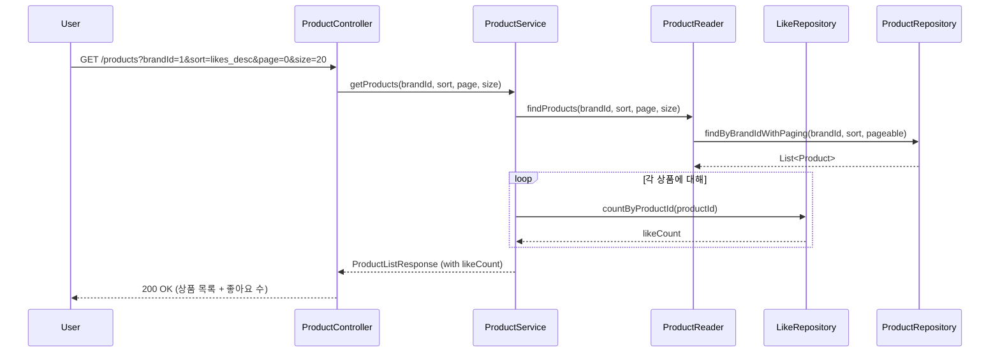
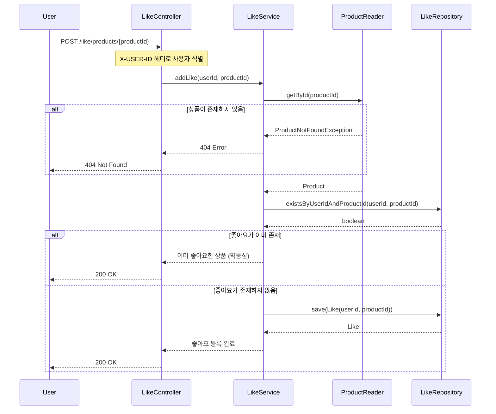
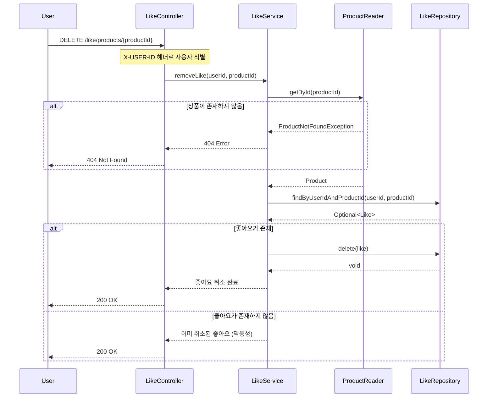
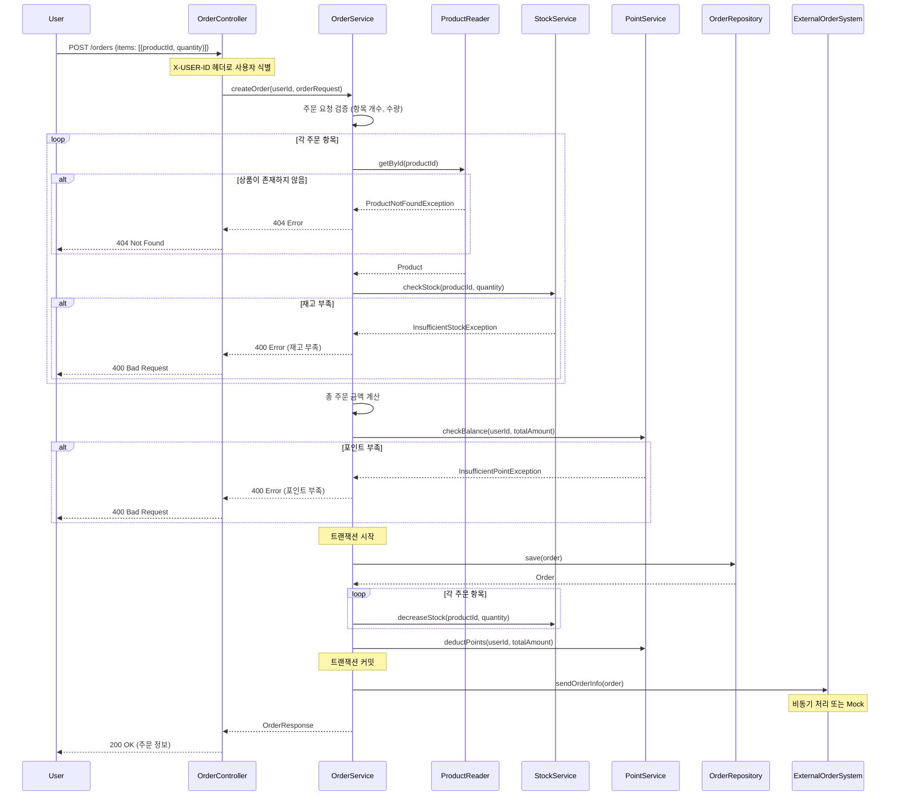
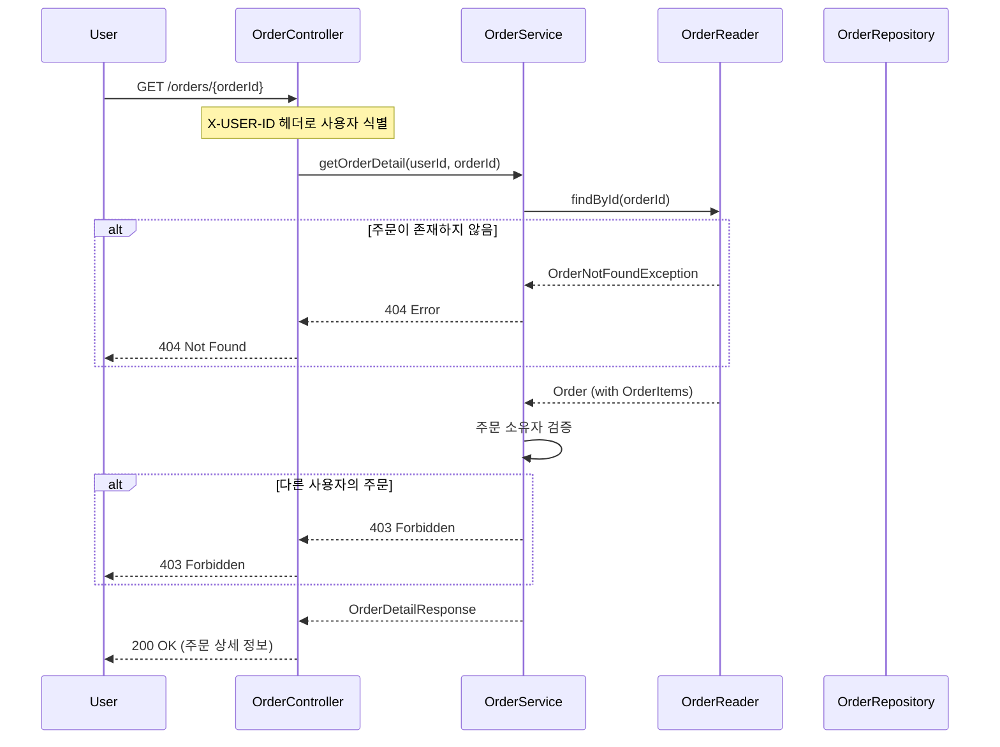

# 시퀀스 다이어그램

주요 기능의 객체 간 협력 구조를 시각화

## 1. 상품 목록 조회 (필터링 & 정렬)

- 사용자가 상품 목록을 조회하는 흐름
- 브랜드 필터링, 정렬 기준, 페이징을 지원

- **주요 책임**
  - `ProductController`: 요청 검증 및 응답 변환
  - `ProductService`: 비즈니스 로직 조율 (상품 조회 + 좋아요 수 집계)
  - `ProductReader`: 상품 조회 전용 인터페이스
  - `ProductRepository`: 데이터 접근
  - `LikeRepository`: 좋아요 데이터 접근
- **설계 포인트**
  - 읽기 전용 작업은 Reader 인터페이스 활용
  - 좋아요 수는 별도 집계 (N+1 문제 고려 필요)

## 2. 상품 좋아요 등록

- 사용자가 상품에 좋아요를 등록하는 흐름
- 멱등성을 보장

- **주요 책임**
  - `LikeController`: 사용자 인증 및 요청 처리
  - `LikeService`: 좋아요 비즈니스 로직 (멱등성 보장)
  - `ProductReader`: 상품 존재 여부 확인
  - `LikeRepository`: 좋아요 데이터 접근
- **설계 포인트**
  - 멱등성 보장: 이미 좋아요한 경우 중복 저장하지 않음
  - 상품 존재 여부 사전 검증

## 3. 상품 좋아요 취소

- 사용자가 상품에 대한 좋아요를 취소하는 흐름
- 멱등성을 보장

- **주요 책임**
  - `LikeController`: 사용자 인증 및 요청 처리
  - `LikeService`: 좋아요 비즈니스 로직 (멱등성 보장)
  - `ProductReader`: 상품 존재 여부 확인
  - `LikeRepository`: 좋아요 데이터 접근
- **설계 포인트**
  - 멱등성 보장: 이미 취소된 경우에도 에러 없이 성공 응답
  - 상품 존재 여부 사전 검증

## 4. 주문 생성

- 사용자가 여러 상품을 주문하는 흐름
- 재고 차감, 포인트 차감, 외부 시스템 연동을 포함

- **주요 책임**
  - `OrderController`: 요청 검증 및 응답 변환
  - `OrderService`: 주문 비즈니스 로직 조율 (검증, 트랜잭션 관리)
  - `ProductReader`: 상품 정보 조회
  - `StockService`: 재고 확인 및 차감
  - `PointService`: 포인트 확인 및 차감
  - `OrderRepository`: 주문 데이터 저장
  - `ExternalOrderSystem`: 외부 시스템 연동 (Mock 가능)
- **설계 포인트**
  - 트랜잭션 범위: 주문 저장, 재고 차감, 포인트 차감
  - 사전 검증: 상품 존재, 재고 확인, 포인트 확인
  - 외부 시스템 연동은 트랜잭션 외부에서 처리 (또는 비동기)
  - 예외 처리: 재고 부족, 포인트 부족 등 명확한 에러 메시지

## 5. 주문 상세 조회

- 사용자가 자신의 주문 상세 정보를 조회하는 흐름

- **주요 책임**
  - `OrderController`: 요청 검증 및 응답 변환
  - `OrderService`: 주문 조회 및 권한 검증
  - `OrderReader`: 주문 조회 전용 인터페이스
  - `OrderRepository`: 데이터 접근
- **설계 포인트**
  - 본인 주문만 조회 가능 (권한 검증)
  - 주문 항목(OrderItems) 정보 포함
  - 읽기 전용 작업은 Reader 인터페이스 활용

## 설계 원칙 정리

### 1. 책임 분리

- Controller: 요청/응답 변환, 사용자 인증
- Service: 비즈니스 로직 조율, 트랜잭션 관리
- Reader: 읽기 전용 작업
- Repository: 데이터 접근

### 2. 멱등성 보장

- 좋아요 등록/취소는 중복 요청 시에도 동일한 결과 반환
- 에러 대신 성공 응답으로 멱등성 구현

### 3. 트랜잭션 관리

- 주문 생성 시 재고 차감, 포인트 차감, 주문 저장을 하나의 트랜잭션으로 처리
- 외부 시스템 연동은 트랜잭션 외부에서 처리

### 4. 예외 처리

- 비즈니스 예외는 적절한 HTTP 상태 코드로 변환
- 명확한 에러 메시지 제공

### 5. 성능 고려

- N+1 문제 고려 (좋아요 수 집계)
- 읽기 전용 작업은 별도 인터페이스로 분리
