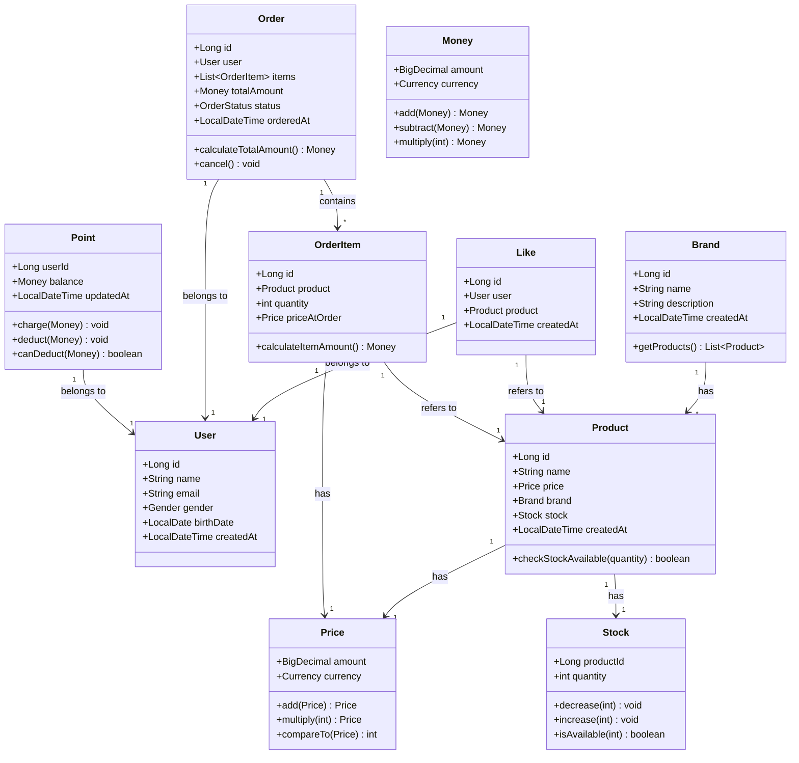
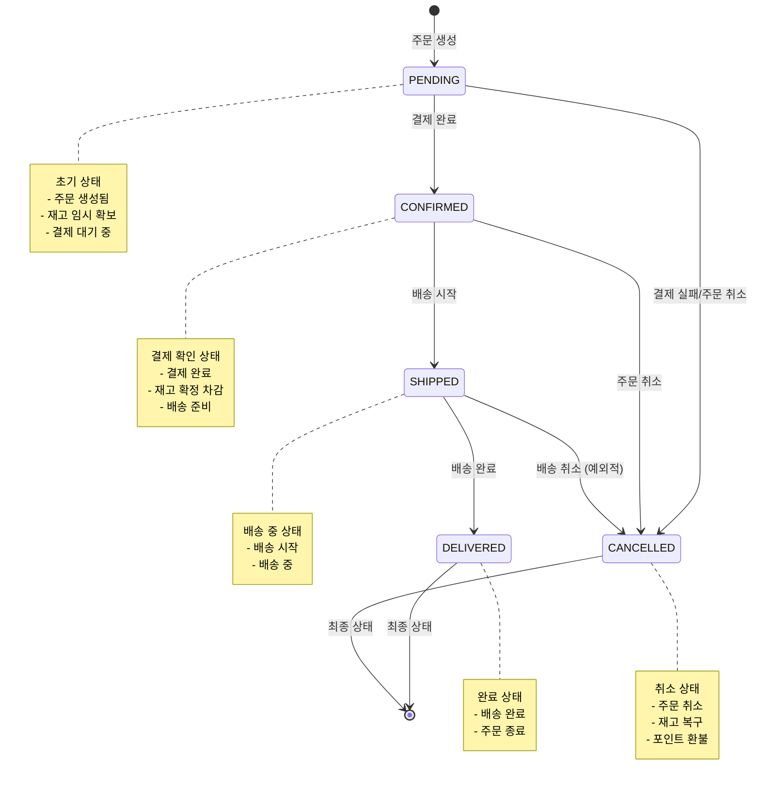

# 클래스 다이어그램 & 도메인 모델

이커머스 시스템의 도메인 객체와 그들 간의 관계를 정의

## 전체 도메인 모델



## 도메인 객체 상세 설명

### 1. User (사용자)

- **책임**
  - 사용자 기본 정보 관리
  - 사용자 식별
- **속성**
  - `id`: 사용자 고유 식별자
  - `name`: 사용자 이름
  - `email`: 이메일 주소
  - `gender`: 성별 (enum)
  - `birthDate`: 생년월일
  - `createdAt`: 가입 일시
- **설계 포인트**
  - Entity (식별자 존재, 독립적 생명 주기)
  - 인증/인가는 구현하지 않음 (X-USER-ID 헤더 사용)

### 2. Brand (브랜드)

- **책임**
  - 브랜드 정보 관리
  - 소속 상품 관리
- **속성**
  - `id`: 브랜드 고유 식별자
  - `name`: 브랜드 이름
  - `description`: 브랜드 설명
  - `createdAt`: 등록 일시
- **메서드**
  - `getProducts()`: 해당 브랜드의 상품 목록 조회
- **설계 포인트**
  - Entity (식별자 존재)
  - Product와 1:N 관계

### 3. Product (상품)

- **책임**
  - 상품 기본 정보 관리
  - 재고 확인 로직
  - 브랜드 연관 관계
- **속성**
  - `id`: 상품 고유 식별자
  - `name`: 상품 이름
  - `price`: 상품 가격 (VO)
  - `brand`: 소속 브랜드
  - `stock`: 재고 정보
  - `createdAt`: 등록 일시
- **메서드**
  - `checkStockAvailable(quantity)`: 요청 수량만큼 재고가 있는지 확인
- **설계 포인트**
  - Entity (식별자 존재)
  - Brand와 N:1 관계 (단방향)
  - Price를 VO로 포함
  - Stock과 1:1 관계

### 4. Price (가격) - Value Object

- **책임**
  - 금액 표현 및 계산
  - 통화 단위 관리
- **속성**
  - `amount`: 금액 (BigDecimal)
  - `currency`: 통화 (enum: KRW, USD 등)
- **메서드**
  - `add(Price)`: 가격 더하기
  - `multiply(int)`: 가격 곱하기
  - `compareTo(Price)`: 가격 비교
- **설계 포인트**
  - Value Object (식별자 없음, 불변)
  - BigDecimal로 정확한 금액 계산
  - 통화 단위 포함하여 다국가 지원 가능

### 5. Stock (재고)

- **책임**
  - 상품 재고 관리
  - 재고 증감 로직
- **속성**
  - `productId`: 상품 식별자
  - `quantity`: 재고 수량
- **메서드**
  - `decrease(int)`: 재고 감소
  - `increase(int)`: 재고 증가
  - `isAvailable(int)`: 재고 확인
- **설계 포인트**
  - Entity (productId로 식별)
  - Product와 1:1 관계
  - 동시성 제어 필요 (낙관적/비관적 락)

### 6. Like (좋아요)

- **책임**
  - 사용자의 상품 좋아요 관계 관리
- **속성**
  - `id`: 좋아요 고유 식별자
  - `user`: 좋아요한 사용자
  - `product`: 좋아요 대상 상품
  - `createdAt`: 좋아요 등록 일시
- **설계 포인트**
  - Entity (식별자 존재)
  - User와 N:1 관계
  - Product와 N:1 관계
  - 복합 유니크 제약: (userId, productId)

### 7. Order (주문)

- **책임**
  - 주문 정보 관리
  - 주문 총액 계산
  - 주문 상태 관리
- **속성**
  - `id`: 주문 고유 식별자
  - `user`: 주문한 사용자
  - `items`: 주문 항목 목록
  - `totalAmount`: 총 주문 금액
  - `status`: 주문 상태 (enum)
  - `orderedAt`: 주문 일시
- **메서드**
  - `calculateTotalAmount()`: 총 주문 금액 계산
  - `cancel()`: 주문 취소
- **설계 포인트**
  - Entity (식별자 존재)
  - Aggregate Root (OrderItem을 포함하는 집합체)
  - User와 N:1 관계
  - OrderItem과 1:N 관계 (Composition)

### 8. OrderItem (주문 항목)

- **책임**
  - 주문 내 개별 상품 정보 관리
  - 주문 시점의 가격 보존
- **속성**
  - `id`: 주문 항목 고유 식별자
  - `product`: 주문한 상품
  - `quantity`: 주문 수량
  - `priceAtOrder`: 주문 시점의 가격 (불변)
- **메서드**
  - `calculateItemAmount()`: 항목별 금액 계산 (가격 × 수량)
- **설계 포인트**
  - Entity (식별자 존재)
  - Order의 일부 (독립적으로 존재 불가)
  - Product와 N:1 관계
  - 주문 시점의 가격을 저장 (상품 가격 변경에 영향받지 않음)

### 9. Money (금액) - Value Object

- **책임**
  - 금액 표현 및 계산
  - 통화 단위 관리
- **속성**
  - `amount`: 금액 (BigDecimal)
  - `currency`: 통화 (enum: KRW, USD 등)
- **메서드**
  - `add(Money)`: 금액 더하기
  - `subtract(Money)`: 금액 빼기
  - `multiply(int)`: 금액 곱하기
- **설계 포인트**
  - Value Object (식별자 없음, 불변)
  - Price와 유사하지만 더 넓은 범위에서 사용 (주문 총액, 포인트 등)

### 10. Point (포인트)

- **책임**
  - 사용자 포인트 관리
  - 포인트 충전 및 차감
- **속성**
  - `userId`: 사용자 식별자
  - `balance`: 보유 포인트 (Money)
  - `updatedAt`: 최근 갱신 일시
- **메서드**
  - `charge(Money)`: 포인트 충전
  - `deduct(Money)`: 포인트 차감
  - `canDeduct(Money)`: 차감 가능 여부 확인
- **설계 포인트**
  - Entity (userId로 식별)
  - User와 1:1 관계
  - 동시성 제어 필요 (낙관적/비관적 락)

## Enum 정의

### Gender (성별)

```kotlin
enum class Gender {
    MALE,
    FEMALE,
    OTHER
}
```

### Currency (통화)

```kotlin
enum class Currency {
    KRW,  // 한국 원
    USD   // 미국 달러
}
```

### OrderStatus (주문 상태)

```kotlin
enum class OrderStatus {
    PENDING,      // 대기 중
    CONFIRMED,    // 확인됨
    SHIPPED,      // 배송 중
    DELIVERED,    // 배송 완료
    CANCELLED     // 취소됨
}
```

## 연관 관계 정리

### 단방향 연관 관계

- Product → Brand: 상품은 자신이 속한 브랜드를 알아야 함
- Product → Stock: 상품은 자신의 재고를 알아야 함
- Like → User: 좋아요는 사용자를 알아야 함
- Like → Product: 좋아요는 상품을 알아야 함
- Order → User: 주문은 주문자를 알아야 함
- OrderItem → Product: 주문 항목은 상품을 알아야 함
- Point → User: 포인트는 소유자를 알아야 함

### 양방향 연관 관계 최소화

- Brand ↔ Product: 필요시 양방향으로 확장 가능하나, 기본은 단방향
- Order → OrderItem: 주문이 항목을 포함 (Composition)

## 설계 원칙

### 1. Entity vs Value Object 구분

- **Entity**: 식별자가 있고 생명 주기가 독립적 (User, Product, Order 등)
- **Value Object**: 식별자가 없고 불변 (Price, Money 등)

### 2. Aggregate 설계

- **Order가 OrderItem의 Aggregate Root**
- OrderItem은 Order를 통해서만 접근
- 트랜잭션 경계는 Aggregate 단위

### 3. 책임 주도 설계

- 도메인 로직은 도메인 객체가 직접 처리
- 예: Stock.decrease(), Order.calculateTotalAmount()
- Service는 도메인 객체를 조율하는 역할

### 4. 불변성

- Value Object는 불변으로 설계
- 수정이 필요하면 새 객체 생성

### 5. 연관 관계

- 단방향 기본, 양방향 최소화
- 필요한 방향으로만 참조

## 상태 다이어그램

### Order 상태 전이

주문(Order)의 생명주기 동안 상태가 어떻게 변화하는지 표현합니다.



### 상태 전이 조건 및 액션

| 현재 상태 | 이벤트 | 다음 상태 | 액션 |
|---------|--------|---------|------|
| - | 주문 생성 요청 | PENDING | • 재고 확인 및 임시 예약<br>• 주문 생성<br>• 결제 대기 |
| PENDING | 결제 완료 | CONFIRMED | • 포인트 차감<br>• 재고 확정 차감<br>• 배송 준비 시작 |
| PENDING | 결제 실패 | CANCELLED | • 임시 예약 재고 해제<br>• 주문 취소 처리 |
| PENDING | 주문 취소 요청 | CANCELLED | • 임시 예약 재고 해제<br>• 주문 취소 처리 |
| CONFIRMED | 배송 시작 | SHIPPED | • 배송 정보 등록<br>• 배송 상태 추적 시작 |
| CONFIRMED | 주문 취소 요청 | CANCELLED | • 재고 복구<br>• 포인트 환불<br>• 주문 취소 처리 |
| SHIPPED | 배송 완료 | DELIVERED | • 배송 완료 확인<br>• 주문 완료 처리 |
| SHIPPED | 배송 취소 (예외) | CANCELLED | • 재고 복구<br>• 포인트 환불<br>• 배송 취소 처리 |

### 상태별 허용 동작

| 상태 | 조회 | 취소 | 수정 | 배송 추적 |
|-----|-----|-----|-----|----------|
| PENDING | ✅ | ✅ | ✅ | ❌ |
| CONFIRMED | ✅ | ✅ | ❌ | ❌ |
| SHIPPED | ✅ | ⚠️ (제한적) | ❌ | ✅ |
| DELIVERED | ✅ | ❌ | ❌ | ✅ |
| CANCELLED | ✅ | ❌ | ❌ | ❌ |

### 비즈니스 규칙

1. **PENDING → CONFIRMED**
   - 포인트 잔액이 충분해야 함
   - 재고가 충분해야 함 (이중 체크)
   - 주문 생성 후 일정 시간 내에 결제해야 함 (타임아웃)

2. **CONFIRMED → CANCELLED**
   - 배송 시작 전까지만 취소 가능
   - 취소 시 재고 복구 및 포인트 환불 보장

3. **SHIPPED → CANCELLED**
   - 예외적인 경우만 허용 (배송 사고 등)
   - 관리자 승인 필요

4. **최종 상태**
   - DELIVERED, CANCELLED은 최종 상태로 더 이상 변경 불가

## 패키지 구조

```txt
domain/
├── user/
│   ├── User.kt
│   └── Gender.kt
├── brand/
│   └── Brand.kt
├── product/
│   ├── Product.kt
│   ├── Price.kt
│   ├── Stock.kt
│   └── Currency.kt
├── like/
│   └── Like.kt
├── order/
│   ├── Order.kt
│   ├── OrderItem.kt
│   ├── OrderStatus.kt
│   └── Money.kt
└── point/
    └── Point.kt
```
