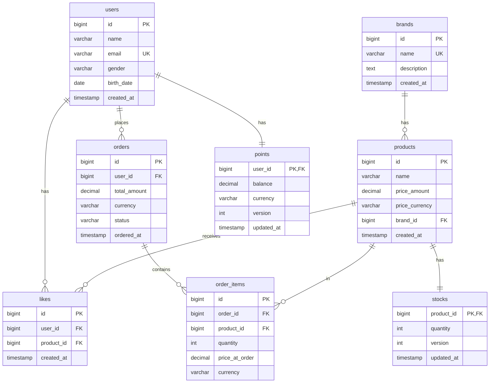

# ERD 설계

이커머스 시스템의 데이터베이스 테이블 구조와 관계를 정의

## 전체 ERD



## 테이블 상세 설명

### 1. users (사용자)

사용자 기본 정보를 저장

| 컬럼명 | 타입 | 제약조건 | 설명 |
| --- | --- | --- | --- |
| id | BIGINT | PK, AUTO_INCREMENT | 사용자 고유 식별자 |
| name | VARCHAR(100) | NOT NULL | 사용자 이름 |
| email | VARCHAR(255) | NOT NULL, UNIQUE | 이메일 주소 |
| gender | VARCHAR(10) | NOT NULL | 성별 (MALE, FEMALE, OTHER) |
| birth_date | DATE | NOT NULL | 생년월일 |
| created_at | TIMESTAMP | NOT NULL, DEFAULT CURRENT_TIMESTAMP | 가입 일시 |

- **인덱스**
  - PRIMARY KEY: `id`
  - UNIQUE KEY: `email`
- **설계 포인트**
  - email을 유니크 키로 설정하여 중복 방지
  - gender는 VARCHAR로 저장 (enum 값)

### 2. brands (브랜드)

브랜드 정보를 저장

| 컬럼명 | 타입 | 제약조건 | 설명 |
| --- | --- | --- | --- |
| id | BIGINT | PK, AUTO_INCREMENT | 브랜드 고유 식별자 |
| name | VARCHAR(100) | NOT NULL, UNIQUE | 브랜드 이름 |
| description | TEXT | NULL | 브랜드 설명 |
| created_at | TIMESTAMP | NOT NULL, DEFAULT CURRENT_TIMESTAMP | 등록 일시 |

- **인덱스**
  - PRIMARY KEY: `id`
  - UNIQUE KEY: `name`
- **설계 포인트**
  - 브랜드 이름은 유니크하게 관리

### 3. products (상품)

상품 정보를 저장

| 컬럼명 | 타입 | 제약조건 | 설명 |
| --- | --- | --- | --- |
| id | BIGINT | PK, AUTO_INCREMENT | 상품 고유 식별자 |
| name | VARCHAR(200) | NOT NULL | 상품 이름 |
| price_amount | DECIMAL(15,2) | NOT NULL | 상품 가격 |
| price_currency | VARCHAR(3) | NOT NULL, DEFAULT 'KRW' | 통화 단위 |
| brand_id | BIGINT | NOT NULL, FK | 브랜드 식별자 |
| created_at | TIMESTAMP | NOT NULL, DEFAULT CURRENT_TIMESTAMP | 등록 일시 |

- **인덱스**
  - PRIMARY KEY: `id`
  - INDEX: `brand_id` (브랜드별 상품 조회)
  - INDEX: `created_at DESC` (최신순 조회)
  - INDEX: `price_amount` (가격순 조회)
- **외래키**
  - `brand_id` REFERENCES `brands(id)` ON DELETE RESTRICT
- **설계 포인트**
  - 가격은 DECIMAL로 정확한 계산 보장
  - price_amount와 price_currency를 분리하여 다국가 지원
  - 브랜드 삭제 시 상품 삭제 방지 (RESTRICT)

### 4. stocks (재고)

상품의 재고 정보를 저장

| 컬럼명 | 타입 | 제약조건 | 설명 |
| --- | --- | --- | --- |
| product_id | BIGINT | PK, FK | 상품 식별자 |
| quantity | INT | NOT NULL, DEFAULT 0 | 재고 수량 |
| version | INT | NOT NULL, DEFAULT 0 | 낙관적 락 버전 |
| updated_at | TIMESTAMP | NOT NULL, DEFAULT CURRENT_TIMESTAMP ON UPDATE CURRENT_TIMESTAMP | 최근 갱신 일시 |

- **인덱스**
  - PRIMARY KEY: `product_id`
- **외래키**
  - `product_id` REFERENCES `products(id)` ON DELETE CASCADE
- **제약조건**
  - CHECK: `quantity >= 0` (재고는 음수 불가)
- **설계 포인트**
  - product_id를 PK로 사용 (1:1 관계)
  - version 컬럼으로 낙관적 락 구현 (동시성 제어)
  - 상품 삭제 시 재고도 함께 삭제 (CASCADE)

### 5. likes (좋아요)

사용자의 상품 좋아요 정보를 저장

| 컬럼명 | 타입 | 제약조건 | 설명 |
| --- | --- | --- | --- |
| id | BIGINT | PK, AUTO_INCREMENT | 좋아요 고유 식별자 |
| user_id | BIGINT | NOT NULL, FK | 사용자 식별자 |
| product_id | BIGINT | NOT NULL, FK | 상품 식별자 |
| created_at | TIMESTAMP | NOT NULL, DEFAULT CURRENT_TIMESTAMP | 좋아요 등록 일시 |

- **인덱스**
  - PRIMARY KEY: `id`
  - UNIQUE KEY: `(user_id, product_id)` (중복 좋아요 방지)
  - INDEX: `user_id` (사용자별 좋아요 조회)
  - INDEX: `product_id` (상품별 좋아요 수 집계)
- **외래키**
  - `user_id` REFERENCES `users(id)` ON DELETE CASCADE
  - `product_id` REFERENCES `products(id)` ON DELETE CASCADE
- **설계 포인트**
  - (user_id, product_id) 복합 유니크 키로 중복 방지
  - 사용자 또는 상품 삭제 시 좋아요도 함께 삭제 (CASCADE)
  - 좋아요 수 집계를 위한 인덱스

### 6. orders (주문)

주문 정보를 저장

| 컬럼명 | 타입 | 제약조건 | 설명 |
| --- | --- | --- | --- |
| id | BIGINT | PK, AUTO_INCREMENT | 주문 고유 식별자 |
| user_id | BIGINT | NOT NULL, FK | 주문한 사용자 식별자 |
| total_amount | DECIMAL(15,2) | NOT NULL | 총 주문 금액 |
| currency | VARCHAR(3) | NOT NULL, DEFAULT 'KRW' | 통화 단위 |
| status | VARCHAR(20) | NOT NULL, DEFAULT 'PENDING' | 주문 상태 |
| ordered_at | TIMESTAMP | NOT NULL, DEFAULT CURRENT_TIMESTAMP | 주문 일시 |

- **인덱스**
  - PRIMARY KEY: `id`
  - INDEX: `user_id` (사용자별 주문 조회)
  - INDEX: `ordered_at DESC` (최신 주문순 조회)
  - INDEX: `status` (상태별 주문 조회)
- **외래키**
  - `user_id` REFERENCES `users(id)` ON DELETE RESTRICT
- **설계 포인트**
  - status는 VARCHAR로 저장 (PENDING, CONFIRMED, SHIPPED, DELIVERED, CANCELLED)
  - 사용자 삭제 시 주문 삭제 방지 (RESTRICT)
  - 주문 일시 기준 정렬을 위한 인덱스

### 7. order_items (주문 항목)

주문에 포함된 상품 정보를 저장

| 컬럼명 | 타입 | 제약조건 | 설명 |
| --- | --- | --- | --- |
| id | BIGINT | PK, AUTO_INCREMENT | 주문 항목 고유 식별자 |
| order_id | BIGINT | NOT NULL, FK | 주문 식별자 |
| product_id | BIGINT | NOT NULL, FK | 상품 식별자 |
| quantity | INT | NOT NULL | 주문 수량 |
| price_at_order | DECIMAL(15,2) | NOT NULL | 주문 시점의 가격 |
| currency | VARCHAR(3) | NOT NULL, DEFAULT 'KRW' | 통화 단위 |

- **인덱스**
  - PRIMARY KEY: `id`
  - INDEX: `order_id` (주문별 항목 조회)
  - INDEX: `product_id` (상품별 주문 이력 조회)
- **외래키**
  - `order_id` REFERENCES `orders(id)` ON DELETE CASCADE
  - `product_id` REFERENCES `products(id)` ON DELETE RESTRICT
- **제약조건**
  - CHECK: `quantity > 0` (수량은 1개 이상)
- **설계 포인트**
  - 주문 삭제 시 항목도 함께 삭제 (CASCADE)
  - 상품 삭제 시 항목 삭제 방지 (RESTRICT) - 주문 이력 보존
  - 주문 시점의 가격을 저장하여 가격 변경에 영향받지 않음

### 8. points (포인트)

사용자의 포인트 정보를 저장

| 컬럼명 | 타입 | 제약조건 | 설명 |
| --- | --- | --- | --- |
| user_id | BIGINT | PK, FK | 사용자 식별자 |
| balance | DECIMAL(15,2) | NOT NULL, DEFAULT 0 | 보유 포인트 |
| currency | VARCHAR(3) | NOT NULL, DEFAULT 'KRW' | 통화 단위 |
| version | INT | NOT NULL, DEFAULT 0 | 낙관적 락 버전 |
| updated_at | TIMESTAMP | NOT NULL, DEFAULT CURRENT_TIMESTAMP ON UPDATE CURRENT_TIMESTAMP | 최근 갱신 일시 |

- **인덱스**
  - PRIMARY KEY: `user_id`
- **외래키**
  - `user_id` REFERENCES `users(id)` ON DELETE CASCADE
- **제약조건**
  - CHECK: `balance >= 0` (포인트는 음수 불가)
- **설계 포인트**
  - user_id를 PK로 사용 (1:1 관계)
  - version 컬럼으로 낙관적 락 구현 (동시성 제어)
  - 사용자 삭제 시 포인트도 함께 삭제 (CASCADE)

## 관계 정리

### 1:1 관계

- `products` ↔ `stocks`: 상품과 재고는 1:1 관계
- `users` ↔ `points`: 사용자와 포인트는 1:1 관계

### 1:N 관계

- `brands` → `products`: 하나의 브랜드는 여러 상품을 가짐
- `users` → `likes`: 하나의 사용자는 여러 좋아요를 할 수 있음
- `products` → `likes`: 하나의 상품은 여러 좋아요를 받을 수 있음
- `users` → `orders`: 하나의 사용자는 여러 주문을 할 수 있음
- `orders` → `order_items`: 하나의 주문은 여러 항목을 포함함
- `products` → `order_items`: 하나의 상품은 여러 주문에 포함될 수 있음

### N:M 관계

- `users` ↔ `products` (through `likes`): 사용자와 상품은 좋아요를 통해 N:M 관계

## 인덱스 전략

### 조회 성능 최적화

1. **상품 목록 조회**
   - `products.brand_id`: 브랜드별 필터링
   - `products.created_at DESC`: 최신순 정렬
   - `products.price_amount`: 가격순 정렬
2. **좋아요 수 집계**
   - `likes.product_id`: 상품별 좋아요 수 집계
3. **주문 조회**
   - `orders.user_id`: 사용자별 주문 조회
   - `orders.ordered_at DESC`: 최신 주문순 정렬

### 유니크 제약

1. `users.email`: 이메일 중복 방지
2. `brands.name`: 브랜드 이름 중복 방지
3. `likes(user_id, product_id)`: 중복 좋아요 방지

## 동시성 제어

### 낙관적 락 (Optimistic Lock)

- `stocks.version`: 재고 차감 시 동시성 제어
- `points.version`: 포인트 차감 시 동시성 제어

동작 방식

```sql
-- 재고 차감 예시
UPDATE stocks
SET quantity = quantity - :quantity,
    version = version + 1,
    updated_at = CURRENT_TIMESTAMP
WHERE product_id = :productId
  AND version = :currentVersion
  AND quantity >= :quantity;
```

버전이 일치하지 않으면 업데이트 실패 → 재시도 또는 예외 처리

## 데이터 정합성

### 트랜잭션 범위

- 주문 생성 시 다음을 하나의 트랜잭션으로 처리:
  - 1. `orders` 테이블에 주문 저장
  - 2. `order_items` 테이블에 주문 항목 저장
  - 3. `stocks` 테이블에서 재고 차감
  - 4. `points` 테이블에서 포인트 차감

### 외래키 제약

- **CASCADE**: 부모 삭제 시 자식도 함께 삭제
  - `stocks.product_id` → `products.id`
  - `likes.user_id` → `users.id`
  - `likes.product_id` → `products.id`
  - `order_items.order_id` → `orders.id`
  - `points.user_id` → `users.id`
- **RESTRICT**: 자식이 존재하면 부모 삭제 불가
  - `products.brand_id` → `brands.id`
  - `orders.user_id` → `users.id`
  - `order_items.product_id` → `products.id`

## 확장 고려 사항

### 1. 성능 개선

- 좋아요 수를 `products` 테이블에 비정규화 (캐싱)
- 인덱스 추가 (실제 쿼리 패턴 분석 후)

### 2. 이력 관리

- 포인트 충전/사용 이력 테이블 추가 (`point_transactions`)
- 재고 변동 이력 테이블 추가 (`stock_histories`)

### 3. 소프트 삭제

- 사용자, 상품 등에 `deleted_at` 컬럼 추가
- 물리적 삭제 대신 논리적 삭제

### 4. 샤딩 준비

- 사용자 기반 샤딩 고려 (`user_id` 기준)
- 글로벌 유니크 ID 생성 전략 (Snowflake, UUID 등)

## DDL 예시

```sql
-- users 테이블 생성
CREATE TABLE users (
    id BIGINT AUTO_INCREMENT PRIMARY KEY,
    name VARCHAR(100) NOT NULL,
    email VARCHAR(255) NOT NULL UNIQUE,
    gender VARCHAR(10) NOT NULL,
    birth_date DATE NOT NULL,
    created_at TIMESTAMP NOT NULL DEFAULT CURRENT_TIMESTAMP,
    INDEX idx_email (email)
);

-- brands 테이블 생성
CREATE TABLE brands (
    id BIGINT AUTO_INCREMENT PRIMARY KEY,
    name VARCHAR(100) NOT NULL UNIQUE,
    description TEXT,
    created_at TIMESTAMP NOT NULL DEFAULT CURRENT_TIMESTAMP,
    INDEX idx_name (name)
);

-- products 테이블 생성
CREATE TABLE products (
    id BIGINT AUTO_INCREMENT PRIMARY KEY,
    name VARCHAR(200) NOT NULL,
    price_amount DECIMAL(15,2) NOT NULL,
    price_currency VARCHAR(3) NOT NULL DEFAULT 'KRW',
    brand_id BIGINT NOT NULL,
    created_at TIMESTAMP NOT NULL DEFAULT CURRENT_TIMESTAMP,
    INDEX idx_brand_id (brand_id),
    INDEX idx_created_at (created_at DESC),
    INDEX idx_price_amount (price_amount),
    FOREIGN KEY (brand_id) REFERENCES brands(id) ON DELETE RESTRICT
);

-- stocks 테이블 생성
CREATE TABLE stocks (
    product_id BIGINT PRIMARY KEY,
    quantity INT NOT NULL DEFAULT 0 CHECK (quantity >= 0),
    version INT NOT NULL DEFAULT 0,
    updated_at TIMESTAMP NOT NULL DEFAULT CURRENT_TIMESTAMP ON UPDATE CURRENT_TIMESTAMP,
    FOREIGN KEY (product_id) REFERENCES products(id) ON DELETE CASCADE
);

-- likes 테이블 생성
CREATE TABLE likes (
    id BIGINT AUTO_INCREMENT PRIMARY KEY,
    user_id BIGINT NOT NULL,
    product_id BIGINT NOT NULL,
    created_at TIMESTAMP NOT NULL DEFAULT CURRENT_TIMESTAMP,
    UNIQUE KEY uk_user_product (user_id, product_id),
    INDEX idx_user_id (user_id),
    INDEX idx_product_id (product_id),
    FOREIGN KEY (user_id) REFERENCES users(id) ON DELETE CASCADE,
    FOREIGN KEY (product_id) REFERENCES products(id) ON DELETE CASCADE
);

-- orders 테이블 생성
CREATE TABLE orders (
    id BIGINT AUTO_INCREMENT PRIMARY KEY,
    user_id BIGINT NOT NULL,
    total_amount DECIMAL(15,2) NOT NULL,
    currency VARCHAR(3) NOT NULL DEFAULT 'KRW',
    status VARCHAR(20) NOT NULL DEFAULT 'PENDING',
    ordered_at TIMESTAMP NOT NULL DEFAULT CURRENT_TIMESTAMP,
    INDEX idx_user_id (user_id),
    INDEX idx_ordered_at (ordered_at DESC),
    INDEX idx_status (status),
    FOREIGN KEY (user_id) REFERENCES users(id) ON DELETE RESTRICT
);

-- order_items 테이블 생성
CREATE TABLE order_items (
    id BIGINT AUTO_INCREMENT PRIMARY KEY,
    order_id BIGINT NOT NULL,
    product_id BIGINT NOT NULL,
    quantity INT NOT NULL CHECK (quantity > 0),
    price_at_order DECIMAL(15,2) NOT NULL,
    currency VARCHAR(3) NOT NULL DEFAULT 'KRW',
    INDEX idx_order_id (order_id),
    INDEX idx_product_id (product_id),
    FOREIGN KEY (order_id) REFERENCES orders(id) ON DELETE CASCADE,
    FOREIGN KEY (product_id) REFERENCES products(id) ON DELETE RESTRICT
);

-- points 테이블 생성
CREATE TABLE points (
    user_id BIGINT PRIMARY KEY,
    balance DECIMAL(15,2) NOT NULL DEFAULT 0 CHECK (balance >= 0),
    currency VARCHAR(3) NOT NULL DEFAULT 'KRW',
    version INT NOT NULL DEFAULT 0,
    updated_at TIMESTAMP NOT NULL DEFAULT CURRENT_TIMESTAMP ON UPDATE CURRENT_TIMESTAMP,
    FOREIGN KEY (user_id) REFERENCES users(id) ON DELETE CASCADE
);
```
