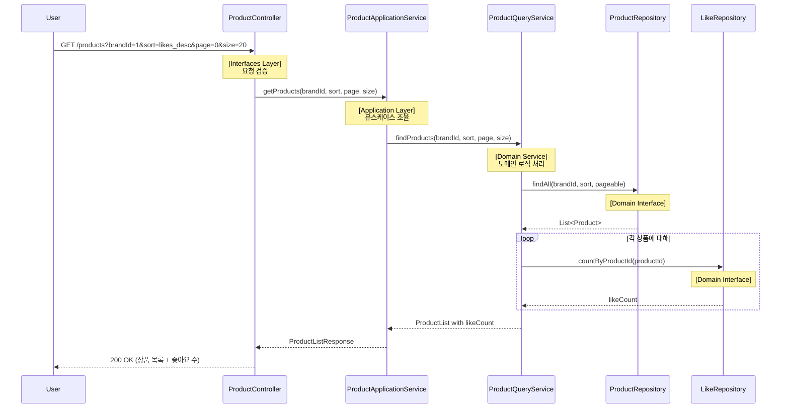
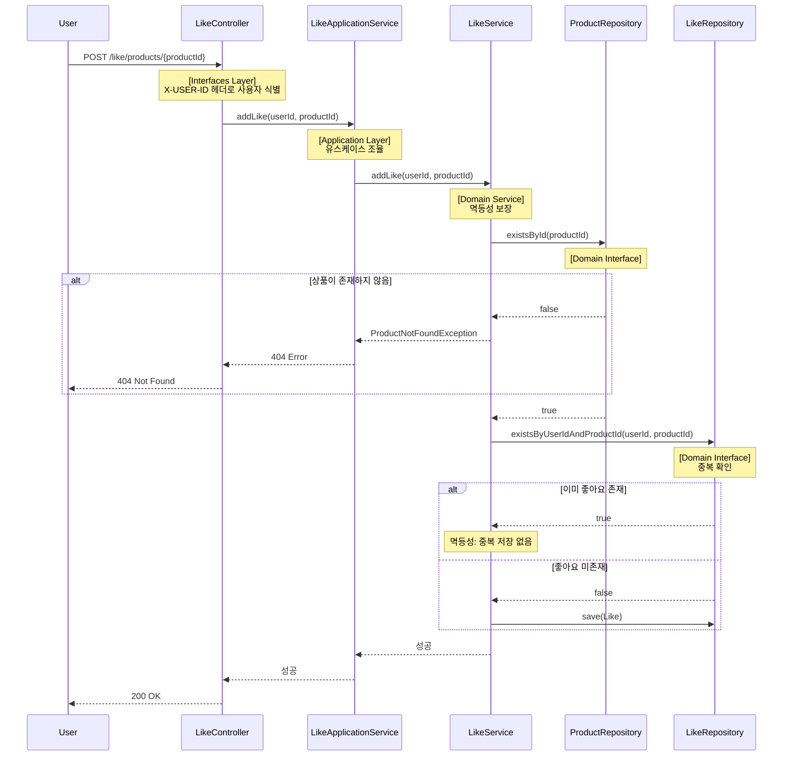
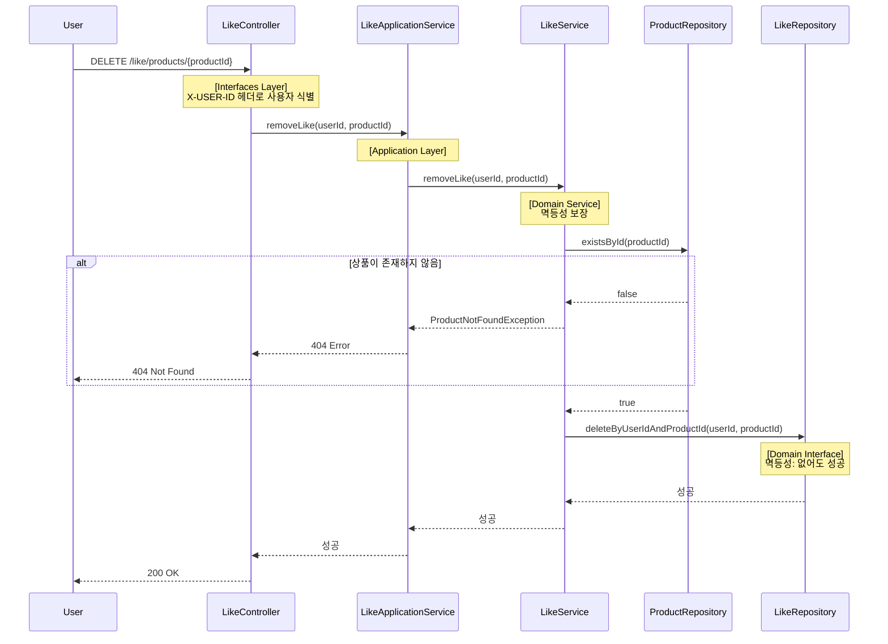
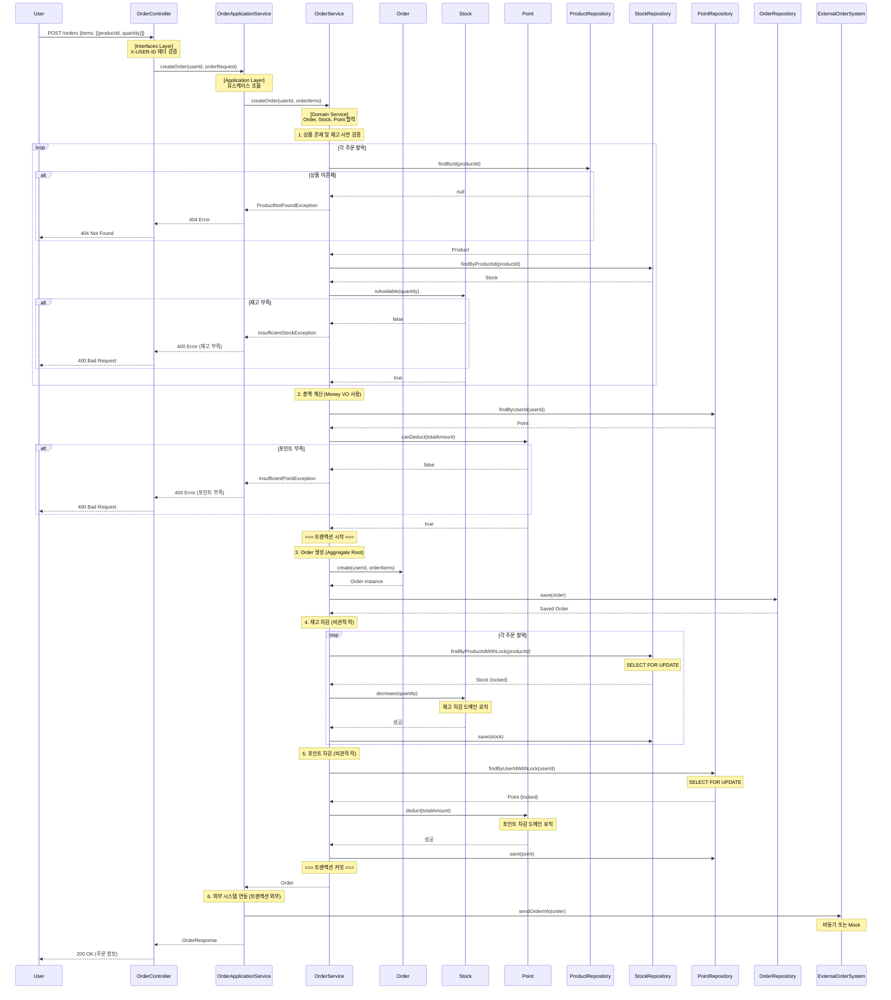
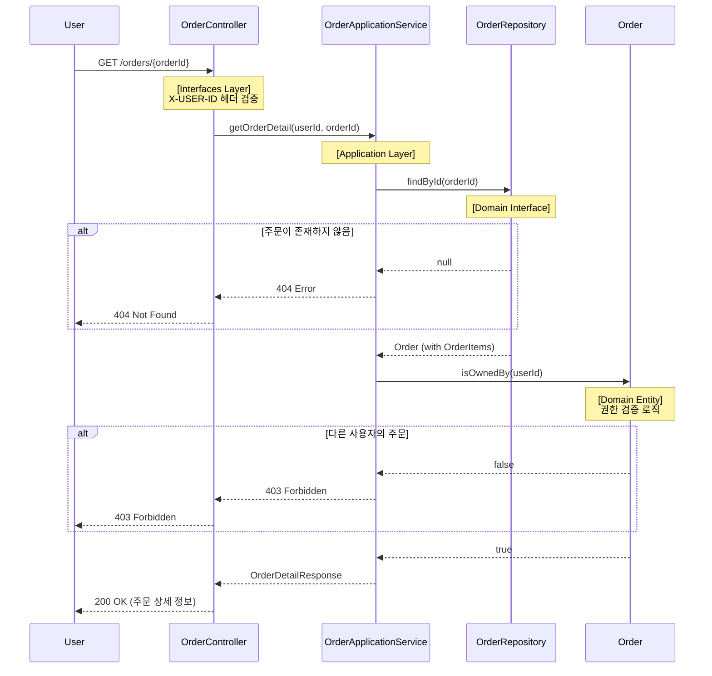

# 시퀀스 다이어그램

주요 기능의 객체 간 협력 구조를 레이어드 아키텍처 관점에서 시각화

## 레이어드 아키텍처 구조

```
[Interfaces Layer]     → ProductController (요청/응답 처리)
         ↓
[Application Layer]    → ProductApplicationService (유스케이스 조율)
         ↓
[Domain Layer]         → ProductQueryService (Domain Service)
                       → Product, Price (Entity, VO)
                       → ProductRepository (Interface)
                       → LikeRepository (Interface)
         ↓
[Infrastructure Layer] → ProductRepositoryImpl (JPA 구현체)
                       → LikeRepositoryImpl (JPA 구현체)
```

## 1. 상품 목록 조회 (필터링 & 정렬)

- 사용자가 상품 목록을 조회하는 흐름
- 브랜드 필터링, 정렬 기준, 페이징을 지원



- **레이어별 책임**
  - `ProductController (Interfaces)`: HTTP 요청 검증 및 응답 DTO 변환
  - `ProductApplicationService (Application)`: 유스케이스 흐름 조율 (경량)
  - `ProductQueryService (Domain Service)`: 상품 조회와 좋아요 수 집계 로직
  - `Product, Price (Domain Entity/VO)`: 도메인 객체
  - `ProductRepository, LikeRepository (Domain Interface)`: Repository 인터페이스
  - `ProductRepositoryImpl, LikeRepositoryImpl (Infrastructure)`: JPA 기반 구현체
- **설계 포인트**
  - **의존성 방향**: Application → Domain ← Infrastructure (DIP 적용)
  - **Repository Interface는 Domain Layer에 위치**: 도메인이 필요로 하는 계약 정의
  - **Infrastructure는 Domain을 구현**: JPA 구현체가 Domain의 Repository를 구현
  - 좋아요 수는 별도 집계 (N+1 문제 고려 필요)

## 2. 상품 좋아요 등록

- 사용자가 상품에 좋아요를 등록하는 흐름
- 멱등성을 보장



- **레이어별 책임**
  - `LikeController (Interfaces)`: 사용자 인증, HTTP 요청 처리
  - `LikeApplicationService (Application)`: 유스케이스 흐름 조율
  - `LikeService (Domain Service)`: 멱등성 보장, 중복 확인 로직
  - `Like (Domain Entity)`: User와 Product 관계 표현
  - `ProductRepository, LikeRepository (Domain Interface)`: Repository 인터페이스
- **설계 포인트**
  - **도메인 간 협력**: LikeService는 ProductRepository를 통해 상품 존재 여부 확인
  - **멱등성 보장**: 중복 확인 로직은 Domain Service에 위치
  - **Repository는 Domain Interface**: 도메인이 필요로 하는 기능을 인터페이스로 정의

## 3. 상품 좋아요 취소

- 사용자가 상품에 대한 좋아요를 취소하는 흐름
- 멱등성을 보장



- **레이어별 책임**
  - `LikeController (Interfaces)`: 사용자 인증, HTTP 요청 처리
  - `LikeApplicationService (Application)`: 유스케이스 흐름 조율
  - `LikeService (Domain Service)`: 멱등성 보장, 삭제 로직
  - `ProductRepository, LikeRepository (Domain Interface)`: Repository 인터페이스
- **설계 포인트**
  - **멱등성 보장**: 이미 취소된 경우에도 에러 없이 성공 응답
  - **도메인 로직**: 멱등성 처리는 Domain Service에 위치

## 4. 주문 생성

- 사용자가 여러 상품을 주문하는 흐름
- 재고 차감, 포인트 차감, 외부 시스템 연동을 포함



- **레이어별 책임**
  - `OrderController (Interfaces)`: HTTP 요청 검증 및 응답 변환
  - `OrderApplicationService (Application)`: 유스케이스 흐름 조율, 트랜잭션 경계, 외부 시스템 연동
  - `OrderService (Domain Service)`: Order, Stock, Point 협력 조율, 비즈니스 로직
  - `Order (Entity, Aggregate Root)`: 주문 정보, OrderItem 관리, 총액 계산
  - `Stock (Entity)`: 재고 관리, `decrease()`, `isAvailable()` 메서드
  - `Point (Entity)`: 포인트 관리, `deduct()`, `canDeduct()` 메서드
  - `Money (VO)`: 금액 연산
  - `Repositories (Domain Interfaces)`: 영속성 계약
- **설계 포인트**
  - **Domain Service의 역할**: 여러 도메인 객체(Order, Stock, Point)의 협력 조율
  - **Entity의 책임**: 각 Entity는 자신의 상태 변경 로직을 직접 처리
  - **VO의 활용**: Money VO로 금액 연산의 안정성 확보
  - **Repository는 Domain Interface**: DIP 적용으로 테스트 용이성 확보
  - **트랜잭션 범위**: Application Layer에서 관리, Domain Service는 비즈니스 로직에 집중
  - **비관적 락**: Stock과 Point 조회 시 SELECT FOR UPDATE로 동시성 제어
  - **사전 검증**: 트랜잭션 실패 최소화를 위한 검증

- **동시성 제어 및 정합성 보장**
  - **TOCTOU (Time-of-Check-Time-of-Use) 갭 최소화**:
    - 사전 검증 (`isAvailable()`): 트랜잭션 전 빠른 실패로 불필요한 트랜잭션 방지
    - 트랜잭션 내 차감 (`decrease()`): 비관적 락으로 최종 확인 및 차감을 원자적으로 수행
    - 두 호출 사이의 경쟁 상태는 트랜잭션 내 비관적 락으로 해결
  - **Stock 동시성 제어**:
    - `StockRepository.findByProductIdWithLock()`: SELECT FOR UPDATE 사용
    - `Stock.decrease()`: 재고 차감 도메인 로직, 음수 방지 검증
    - 여러 사용자의 동시 주문 시 재고 정합성 확보
  - **Point 동시성 제어**:
    - `PointRepository.findByUserIdWithLock()`: SELECT FOR UPDATE 사용
    - `Point.deduct()`: 포인트 차감 도메인 로직, 음수 방지 검증
  - **외부 시스템 연동 실패 처리**:
    - 트랜잭션 외부에서 처리하여 트랜잭션 롤백 방지
    - 실패 시 재시도 큐에 등록 또는 관리자 알람 발송
    - 초기: 재시도 로직 구현 (예: 3회 재시도, 지수 백오프)
    - 향후: 필요 시 보상 트랜잭션 추가 (주문 취소, 재고 복구)

## 5. 주문 상세 조회

- 사용자가 자신의 주문 상세 정보를 조회하는 흐름



- **레이어별 책임**
  - `OrderController (Interfaces)`: HTTP 요청 검증 및 응답 변환
  - `OrderApplicationService (Application)`: 유스케이스 흐름 조율
  - `Order (Entity, Aggregate Root)`: 주문 소유자 확인 메서드 (`isOwnedBy()`)
  - `OrderRepository (Domain Interface)`: 주문 조회 인터페이스
- **설계 포인트**
  - **도메인 로직**: 권한 검증 로직은 Order Entity에 위치 (`isOwnedBy()`)
  - **Aggregate**: Order는 OrderItem을 포함하는 Aggregate Root
  - **응답 데이터**: 주문 항목(OrderItems) 정보 포함

## 설계 원칙 정리

### 1. 레이어드 아키텍처 + DIP

**의존성 방향**: `Application → Domain ← Infrastructure`

```
[Interfaces Layer]
      ↓ (의존)
[Application Layer]
      ↓ (의존)
[Domain Layer] ← (구현) [Infrastructure Layer]
```

**핵심 원칙**:
- **Domain Layer는 독립적**: 다른 계층에 의존하지 않음
- **Repository Interface는 Domain에 위치**: 도메인이 필요로 하는 계약 정의
- **Infrastructure는 Domain을 구현**: JPA 구현체가 Domain Interface를 구현
- **DIP (Dependency Inversion Principle)**: 추상화에 의존, 구체 구현에 의존하지 않음

**올바른 의존성**:
- ✅ `OrderService (Domain)` → `OrderRepository (Domain Interface)`
- ✅ `OrderRepositoryImpl (Infrastructure)` implements `OrderRepository (Domain Interface)`
- ✅ `LikeService (Domain)` → `ProductRepository (Domain Interface)`
- ❌ `OrderService (Domain)` → `OrderRepositoryImpl (Infrastructure)` (직접 구현체 의존)
- ❌ `OrderRepository (Domain Interface)` → `JpaRepository (Infrastructure)` (인터페이스가 인프라에 의존)

### 2. 도메인 모델링: Entity, VO, Domain Service

**Entity (식별자 O, 상태 변경 O)**:
- `User`, `Product`, `Order`, `Brand`, `Like`, `Stock`, `Point`
- 도메인 로직을 직접 처리: `Stock.decrease()`, `Point.deduct()`, `Order.isOwnedBy()`

**Value Object (식별자 X, 불변 O)**:
- `Money`, `Price`
- 금액 연산의 안정성 확보: `Money.add()`, `Price.multiply()`

**Domain Service (상태 X, 협력 조율 O)**:
- `OrderService`: Order, Stock, Point 협력 조율
- `ProductQueryService`: Product 조회와 Like 집계 조합
- `LikeService`: 멱등성 보장 로직

### 3. 레이어별 책임

**Interfaces Layer**:
- HTTP 요청 검증 및 응답 DTO 변환
- 사용자 인증 (X-USER-ID 헤더)
- 예: `ProductController`, `OrderController`

**Application Layer**:
- 유스케이스 흐름 조율 (경량)
- 트랜잭션 경계 설정 (`@Transactional`)
- 외부 시스템 연동
- 예: `ProductApplicationService`, `OrderApplicationService`

**Domain Layer**:
- 비즈니스 로직의 핵심
- Entity, VO, Domain Service
- Repository Interface 정의
- 예: `Order`, `Stock`, `Money`, `OrderService`, `OrderRepository (Interface)`

**Infrastructure Layer**:
- Domain Interface 구현
- JPA, Redis, Kafka 등 기술 의존
- 예: `OrderRepositoryImpl`, `StockRepositoryImpl`

### 4. 멱등성 보장

- 좋아요 등록/취소는 중복 요청 시에도 동일한 결과 반환
- 멱등성 로직은 **Domain Service**에 위치
- 에러 대신 성공 응답으로 멱등성 구현

### 5. 트랜잭션 관리

- 트랜잭션 경계는 **Application Layer**에서 설정 (`@Transactional`)
- Domain Service는 비즈니스 로직에 집중, 트랜잭션을 직접 관리하지 않음
- 주문 생성 시 재고 차감, 포인트 차감, 주문 저장을 하나의 트랜잭션으로 처리
- 외부 시스템 연동은 트랜잭션 외부에서 처리

### 6. 동시성 제어

- 비관적 락 (Pessimistic Lock) 사용: `SELECT FOR UPDATE`
- `StockRepository.findByProductIdWithLock()`, `PointRepository.findByUserIdWithLock()`
- Entity 메서드에서 검증: `Stock.decrease()`, `Point.deduct()`

### 7. 테스트 가능성

- **DIP 적용으로 테스트 용이성 확보**
- Repository를 Fake/Mock으로 교체 가능
- Domain Layer는 독립적이므로 외부 의존 없이 테스트 가능
- 예: `FakeOrderRepository`, `InMemoryStockRepository`

### 8. 예외 처리

- 비즈니스 예외는 적절한 HTTP 상태 코드로 변환 (Interfaces Layer)
- 명확한 에러 메시지 제공
- Domain Layer에서 발생한 예외는 Application Layer를 거쳐 Controller로 전파

### 9. 성능 고려

- N+1 문제 고려 (좋아요 수 집계)
- 읽기 전용 작업은 별도 Query Service로 분리 (`ProductQueryService`)
- 비관적 락의 범위 최소화로 성능 확보
