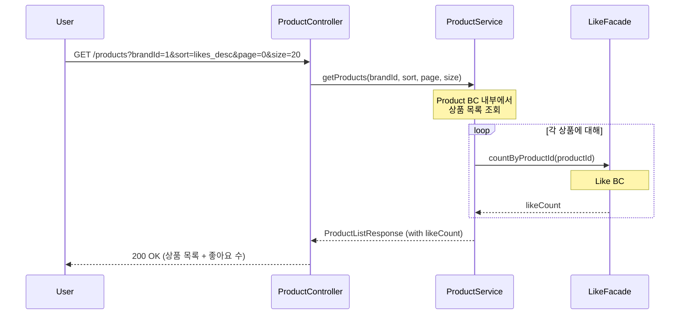
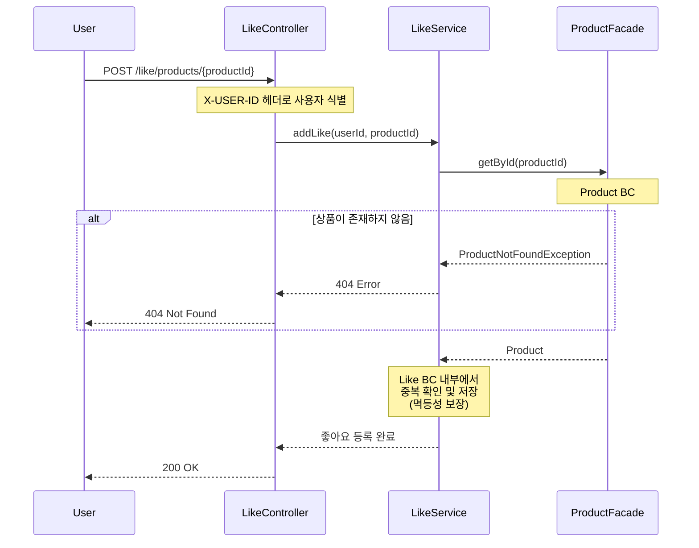
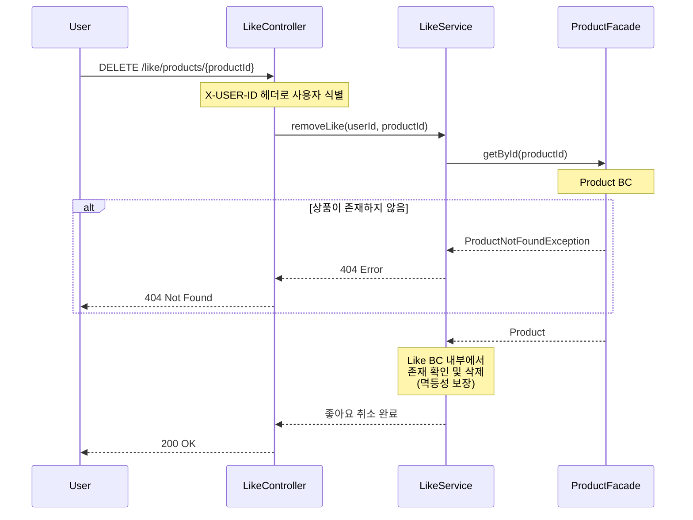
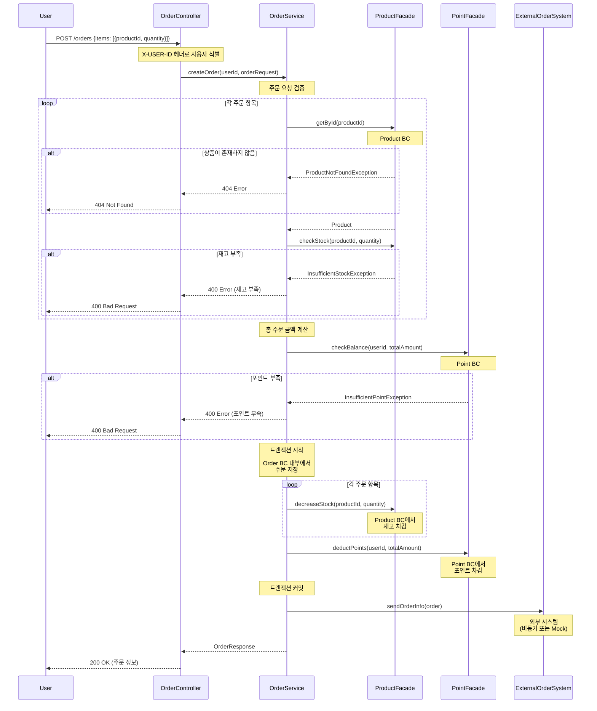
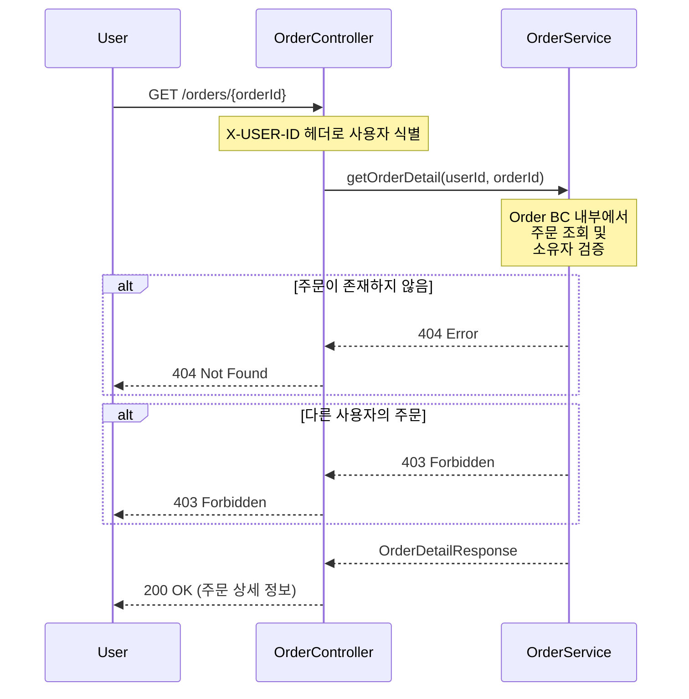

# 시퀀스 다이어그램

주요 기능의 객체 간 협력 구조를 시각화

## 1. 상품 목록 조회 (필터링 & 정렬)

- 사용자가 상품 목록을 조회하는 흐름
- 브랜드 필터링, 정렬 기준, 페이징을 지원

- **주요 책임**
  - `ProductController`: 요청 검증 및 응답 변환
  - `ProductService`: 비즈니스 로직 조율 (Product BC 내부)
  - `LikeFacade`: Like BC의 공개 인터페이스
- **설계 포인트**
  - **BC 간 협력**: Product BC는 Like BC의 공개 인터페이스(LikeFacade)를 통해서만 협력
  - **캡슐화**: 각 BC의 내부 구현(Repository, 도메인 로직 등)은 Facade 뒤에 숨겨짐
  - 좋아요 수는 별도 집계 (N+1 문제 고려 필요)

## 2. 상품 좋아요 등록

- 사용자가 상품에 좋아요를 등록하는 흐름
- 멱등성을 보장

- **주요 책임**
  - `LikeController`: 사용자 인증 및 요청 처리
  - `LikeService`: 좋아요 비즈니스 로직 (Like BC 내부)
  - `ProductFacade`: Product BC의 공개 인터페이스
- **설계 포인트**
  - **BC 간 협력**: Like BC는 Product BC의 공개 인터페이스(ProductFacade)를 통해 상품 존재 여부 확인
  - **캡슐화**: Like BC 내부의 중복 확인, 저장 로직은 Facade 뒤에 숨겨짐
  - 멱등성 보장: 이미 좋아요한 경우 중복 저장하지 않음

## 3. 상품 좋아요 취소

- 사용자가 상품에 대한 좋아요를 취소하는 흐름
- 멱등성을 보장

- **주요 책임**
  - `LikeController`: 사용자 인증 및 요청 처리
  - `LikeService`: 좋아요 비즈니스 로직 (Like BC 내부)
  - `ProductFacade`: Product BC의 공개 인터페이스
- **설계 포인트**
  - **BC 간 협력**: Like BC는 Product BC의 공개 인터페이스(ProductFacade)를 통해 상품 존재 여부 확인
  - **캡슐화**: Like BC 내부의 존재 확인, 삭제 로직은 Facade 뒤에 숨겨짐
  - 멱등성 보장: 이미 취소된 경우에도 에러 없이 성공 응답

## 4. 주문 생성

- 사용자가 여러 상품을 주문하는 흐름
- 재고 차감, 포인트 차감, 외부 시스템 연동을 포함

- **주요 책임**
  - `OrderController`: 요청 검증 및 응답 변환
  - `OrderService`: 주문 비즈니스 로직 조율 (Order BC 내부)
  - `ProductFacade`: Product BC의 공개 인터페이스
  - `PointFacade`: Point BC의 공개 인터페이스
  - `ExternalOrderSystem`: 외부 시스템 연동
- **설계 포인트**
  - **BC 간 협력**: Order BC는 Product BC와 Point BC의 공개 인터페이스(Facade)를 통해서만 협력
  - **캡슐화**: 각 BC의 내부 구현(주문 저장, 재고 차감, 포인트 차감 로직)은 Facade 뒤에 숨겨짐
  - **Stock은 Product BC의 일부**: 재고 관련 작업도 ProductFacade를 통해 처리
  - **트랜잭션 범위**: 주문 저장, 재고 차감, 포인트 차감이 하나의 트랜잭션으로 관리됨
  - **외부 시스템 연동**: 트랜잭션 외부에서 처리하여 성능 및 안정성 확보
  - **사전 검증**: 상품 존재, 재고 확인, 포인트 확인으로 트랜잭션 실패 최소화

- **동시성 제어 및 정합성 보장**
  - **TOCTOU (Time-of-Check-Time-of-Use) 갭 최소화**:
    - `checkStock(156)`: 트랜잭션 전 사전 검증 (빠른 실패, 불필요한 트랜잭션 방지)
    - `decreaseStock(177)`: 트랜잭션 내에서 최종 재고 확인 및 차감을 원자적으로 수행
    - 두 호출 사이의 경쟁 상태는 decreaseStock의 비관적 락으로 해결
  - **Stock 동시성 제어**:
    - `ProductFacade.decreaseStock()` 내부에서 비관적 락(`SELECT FOR UPDATE`) 사용
    - 여러 사용자의 동시 주문 시 재고 정합성 확보
    - 트랜잭션이 끝날 때까지 다른 트랜잭션은 대기
  - **외부 시스템 연동 실패 처리**:
    - 실패 시 재시도 큐에 등록 또는 관리자 알람 발송
    - 초기: 재시도 로직 구현 (예: 3회 재시도, 지수 백오프)
    - 향후: 필요 시 보상 트랜잭션 추가 (주문 취소, 재고 복구)

## 5. 주문 상세 조회

- 사용자가 자신의 주문 상세 정보를 조회하는 흐름

- **주요 책임**
  - `OrderController`: 요청 검증 및 응답 변환
  - `OrderService`: 주문 조회 및 권한 검증 (Order BC 내부)
- **설계 포인트**
  - **캡슐화**: Order BC 내부의 조회 로직, 권한 검증 로직은 Service 내부에 캡슐화
  - **권한 검증**: 본인 주문만 조회 가능
  - **응답 데이터**: 주문 항목(OrderItems) 정보 포함

## 설계 원칙 정리

### 1. Bounded Context 분리 (DDD)

각 도메인은 독립된 Bounded Context로 분리하며, **Facade 인터페이스**를 통해서만 협력합니다.

#### Bounded Context 목록
- **User BC**: 사용자 관리
- **Brand BC**: 브랜드 관리
- **Product BC**: 상품 및 재고 관리 (Stock 포함)
- **Like BC**: 좋아요 관리
- **Order BC**: 주문 관리
- **Point BC**: 포인트 관리

#### Facade 인터페이스
각 BC는 외부에 공개할 기능을 Facade 인터페이스로 제공합니다:
- **ProductFacade**: 상품 조회, 재고 확인/차감 기능
- **LikeFacade**: 좋아요 수 조회 기능
- **PointFacade**: 포인트 확인/차감 기능

#### BC 간 협력 규칙
- ✅ **올바른 협력**: `ServiceA` → `FacadeB` (다른 BC의 공개 인터페이스 사용)
- ❌ **잘못된 협력**: `ServiceA` → `RepositoryB` (다른 BC의 내부 구현 직접 접근)

**예시:**
- ✅ `ProductService` → `LikeFacade.countByProductId()`
- ❌ `ProductService` → `LikeRepository.countByProductId()`
- ✅ `LikeService` → `ProductFacade.getById()`
- ❌ `LikeService` → `ProductRepository.findById()`
- ✅ `OrderService` → `ProductFacade.decreaseStock()`
- ❌ `OrderService` → `StockService.decreaseStock()` (Stock은 Product BC 내부)

### 2. 책임 분리

- **Controller**: 요청/응답 변환, 사용자 인증
- **Service**: 비즈니스 로직 조율, 트랜잭션 관리 (각 BC 내부)
- **Facade**: BC의 공개 인터페이스 (다른 BC와의 협력을 위한 진입점)
- **내부 구현**: Repository, 도메인 로직 등은 BC 내부에 캡슐화되어 외부에서 보이지 않음

### 3. 멱등성 보장

- 좋아요 등록/취소는 중복 요청 시에도 동일한 결과 반환
- 에러 대신 성공 응답으로 멱등성 구현

### 4. 트랜잭션 관리

- 주문 생성 시 재고 차감, 포인트 차감, 주문 저장을 하나의 트랜잭션으로 처리
- 외부 시스템 연동은 트랜잭션 외부에서 처리

### 5. 예외 처리

- 비즈니스 예외는 적절한 HTTP 상태 코드로 변환
- 명확한 에러 메시지 제공

### 6. 성능 고려

- N+1 문제 고려 (좋아요 수 집계)
- 읽기 전용 작업은 별도 인터페이스로 분리
