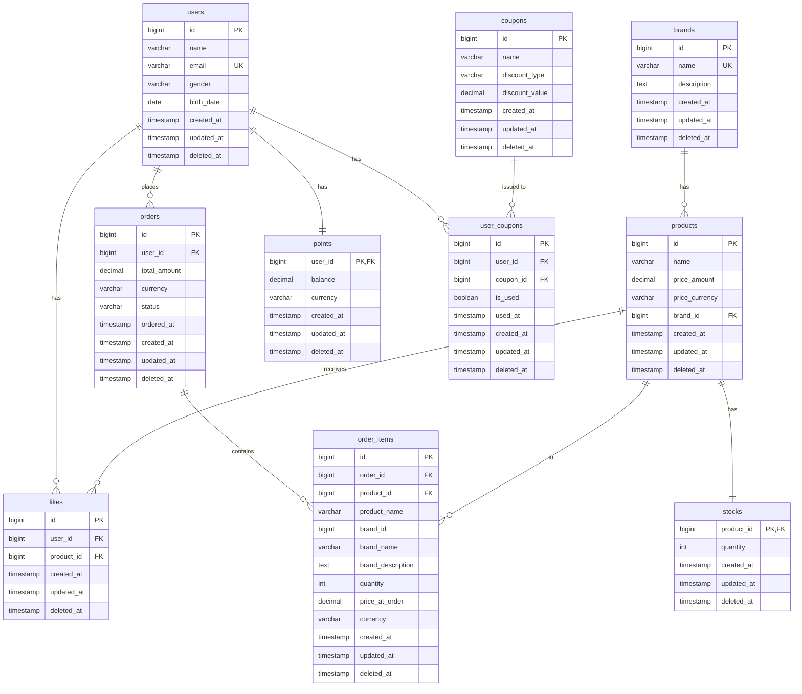

# ERD 설계

이커머스 시스템의 데이터베이스 테이블 구조와 관계를 정의

## 도메인 모델과 ERD의 관계

### Entity → 테이블 매핑

- **Entity**: 고유 식별자를 가진 도메인 객체 → **테이블**로 매핑
  - 예: `User` Entity → `users` 테이블
  - 예: `Product` Entity → `products` 테이블
  - 예: `Order` Entity (Aggregate Root) → `orders` 테이블

### Value Object → 컬럼 매핑

- **Value Object (VO)**: 불변 객체, 식별자 없음 → **테이블 컬럼**으로 매핑
  - 예: `Price` VO → `price_amount`, `price_currency` 컬럼
  - 예: `Money` VO → `balance`, `currency` 컬럼
  - VO는 별도 테이블이 아닌, 소유 Entity의 테이블에 임베드됨

### Aggregate → 테이블 관계

- **Aggregate Root**: 독립적인 테이블
  - 예: `Order` Aggregate Root → `orders` 테이블
- **Aggregate 내부 Entity**: 외래키로 Aggregate Root 참조
  - 예: `OrderItem` → `order_items` 테이블 (order_id FK)

## 전체 ERD



## 테이블 상세 설명

### 1. users (사용자)

**도메인 모델 매핑**: `User` Entity

사용자 기본 정보를 저장

| 컬럼명 | 타입 | 제약조건 | 설명 |
| --- | --- | --- | --- |
| id | BIGINT | PK, AUTO_INCREMENT | 사용자 고유 식별자 |
| name | VARCHAR(100) | NOT NULL | 사용자 이름 |
| email | VARCHAR(255) | NOT NULL, UNIQUE | 이메일 주소 |
| gender | VARCHAR(10) | NOT NULL | 성별 (MALE, FEMALE, OTHER) |
| birth_date | DATE | NOT NULL | 생년월일 |
| created_at | TIMESTAMP | NOT NULL, DEFAULT CURRENT_TIMESTAMP | 가입 일시 |

- **인덱스**
  - PRIMARY KEY: `id`
  - UNIQUE KEY: `email`
- **설계 포인트**
  - email을 유니크 키로 설정하여 중복 방지
  - gender는 VARCHAR로 저장 (enum 값)

### 2. brands (브랜드)

**도메인 모델 매핑**: `Brand` Entity

브랜드 정보를 저장

| 컬럼명 | 타입 | 제약조건 | 설명 |
| --- | --- | --- | --- |
| id | BIGINT | PK, AUTO_INCREMENT | 브랜드 고유 식별자 |
| name | VARCHAR(100) | NOT NULL, UNIQUE | 브랜드 이름 |
| description | TEXT | NULL | 브랜드 설명 |
| created_at | TIMESTAMP | NOT NULL, DEFAULT CURRENT_TIMESTAMP | 등록 일시 |

- **인덱스**
  - PRIMARY KEY: `id`
  - UNIQUE KEY: `name`
- **설계 포인트**
  - 브랜드 이름은 유니크하게 관리

### 3. products (상품)

**도메인 모델 매핑**: `Product` Entity + `Price` Value Object

상품 정보를 저장

| 컬럼명 | 타입 | 제약조건 | 설명 |
| --- | --- | --- | --- |
| id | BIGINT | PK, AUTO_INCREMENT | 상품 고유 식별자 |
| name | VARCHAR(200) | NOT NULL | 상품 이름 |
| price_amount | DECIMAL(15,2) | NOT NULL | 상품 가격 |
| price_currency | VARCHAR(3) | NOT NULL, DEFAULT 'KRW' | 통화 단위 |
| brand_id | BIGINT | NOT NULL, FK | 브랜드 식별자 |
| created_at | TIMESTAMP | NOT NULL, DEFAULT CURRENT_TIMESTAMP | 등록 일시 |

- **인덱스**
  - PRIMARY KEY: `id`
  - INDEX: `brand_id` (브랜드별 상품 조회)
  - INDEX: `created_at DESC` (최신순 조회)
  - INDEX: `price_amount` (가격순 조회)
- **외래키**
  - `brand_id` REFERENCES `brands(id)` ON DELETE RESTRICT
- **설계 포인트**
  - 가격은 DECIMAL로 정확한 계산 보장
  - **Price VO 매핑**: `price_amount`, `price_currency` 컬럼으로 임베드
    - `Price` VO는 별도 테이블이 아닌 Product의 컬럼으로 저장
    - VO의 불변성과 도메인 로직은 애플리케이션 레벨에서 보장
  - price_amount와 price_currency를 분리하여 다국가 지원
  - 브랜드 삭제 시 상품 삭제 방지 (RESTRICT)

### 4. stocks (재고)

**도메인 모델 매핑**: `Stock` Entity

상품의 재고 정보를 저장

| 컬럼명 | 타입 | 제약조건 | 설명 |
| --- | --- | --- | --- |
| product_id | BIGINT | PK, FK | 상품 식별자 |
| quantity | INT | NOT NULL, DEFAULT 0 | 재고 수량 |
| created_at | TIMESTAMP | NOT NULL, DEFAULT CURRENT_TIMESTAMP | 생성 일시 |
| updated_at | TIMESTAMP | NOT NULL, DEFAULT CURRENT_TIMESTAMP ON UPDATE CURRENT_TIMESTAMP | 최근 갱신 일시 |
| deleted_at | TIMESTAMP | NULL | 삭제 일시 (소프트 삭제) |

- **인덱스**
  - PRIMARY KEY: `product_id`
- **외래키**
  - `product_id` REFERENCES `products(id)` ON DELETE CASCADE
- **제약조건**
  - CHECK: `quantity >= 0` (재고는 음수 불가)
- **설계 포인트**
  - product_id를 PK로 사용 (1:1 관계)
  - 비관적 락(SELECT FOR UPDATE)으로 동시성 제어
  - 상품 삭제 시 재고도 함께 삭제 (CASCADE)
  - 소프트 삭제 지원 (`deleted_at`)

### 5. likes (좋아요)

**도메인 모델 매핑**: `Like` Entity

사용자의 상품 좋아요 정보를 저장

| 컬럼명 | 타입 | 제약조건 | 설명 |
| --- | --- | --- | --- |
| id | BIGINT | PK, AUTO_INCREMENT | 좋아요 고유 식별자 |
| user_id | BIGINT | NOT NULL, FK | 사용자 식별자 |
| product_id | BIGINT | NOT NULL, FK | 상품 식별자 |
| created_at | TIMESTAMP | NOT NULL, DEFAULT CURRENT_TIMESTAMP | 좋아요 등록 일시 |

- **인덱스**
  - PRIMARY KEY: `id`
  - UNIQUE KEY: `(user_id, product_id)` (중복 좋아요 방지)
  - INDEX: `user_id` (사용자별 좋아요 조회)
  - INDEX: `product_id` (상품별 좋아요 수 집계)
- **외래키**
  - `user_id` REFERENCES `users(id)` ON DELETE CASCADE
  - `product_id` REFERENCES `products(id)` ON DELETE CASCADE
- **설계 포인트**
  - (user_id, product_id) 복합 유니크 키로 중복 방지
  - 사용자 또는 상품 삭제 시 좋아요도 함께 삭제 (CASCADE)
  - 좋아요 수 집계를 위한 인덱스

### 6. orders (주문)

**도메인 모델 매핑**: `Order` Entity (Aggregate Root) + `Money` Value Object

주문 정보를 저장

| 컬럼명 | 타입 | 제약조건 | 설명 |
| --- | --- | --- | --- |
| id | BIGINT | PK, AUTO_INCREMENT | 주문 고유 식별자 |
| user_id | BIGINT | NOT NULL, FK | 주문한 사용자 식별자 |
| total_amount | DECIMAL(15,2) | NOT NULL | 총 주문 금액 |
| currency | VARCHAR(3) | NOT NULL, DEFAULT 'KRW' | 통화 단위 |
| status | VARCHAR(20) | NOT NULL, DEFAULT 'PENDING' | 주문 상태 |
| ordered_at | TIMESTAMP | NOT NULL, DEFAULT CURRENT_TIMESTAMP | 주문 일시 |

- **인덱스**
  - PRIMARY KEY: `id`
  - INDEX: `user_id` (사용자별 주문 조회)
  - INDEX: `ordered_at DESC` (최신 주문순 조회)
  - INDEX: `status` (상태별 주문 조회)
- **외래키**
  - `user_id` REFERENCES `users(id)` ON DELETE RESTRICT
- **설계 포인트**
  - **Money VO 매핑**: `total_amount`, `currency` 컬럼으로 임베드
    - `Money` VO는 별도 테이블이 아닌 Order의 컬럼으로 저장
  - **Aggregate Root**: Order는 OrderItem을 포함하는 집합체의 루트
  - status는 VARCHAR로 저장 (PENDING, CONFIRMED, SHIPPED, DELIVERED, CANCELLED)
  - 사용자 삭제 시 주문 삭제 방지 (RESTRICT)
  - 주문 일시 기준 정렬을 위한 인덱스

### 7. order_items (주문 항목)

**도메인 모델 매핑**: `OrderItem` Entity + `Price` Value Object

주문에 포함된 상품 정보를 저장 (주문 시점의 상품 및 브랜드 정보 스냅샷)

| 컬럼명 | 타입 | 제약조건 | 설명 |
| --- | --- | --- | --- |
| id | BIGINT | PK, AUTO_INCREMENT | 주문 항목 고유 식별자 |
| order_id | BIGINT | NOT NULL, FK | 주문 식별자 |
| product_id | BIGINT | NOT NULL, FK | 상품 식별자 (참조용) |
| product_name | VARCHAR(200) | NOT NULL | 주문 시점의 상품명 (스냅샷) |
| brand_id | BIGINT | NOT NULL | 주문 시점의 브랜드 ID (스냅샷) |
| brand_name | VARCHAR(100) | NOT NULL | 주문 시점의 브랜드명 (스냅샷) |
| brand_description | TEXT | NULL | 주문 시점의 브랜드 설명 (스냅샷) |
| quantity | INT | NOT NULL | 주문 수량 |
| price_at_order | DECIMAL(15,2) | NOT NULL | 주문 시점의 가격 (스냅샷) |
| currency | VARCHAR(3) | NOT NULL, DEFAULT 'KRW' | 통화 단위 |

- **인덱스**
  - PRIMARY KEY: `id`
  - INDEX: `order_id` (주문별 항목 조회)
  - INDEX: `product_id` (상품별 주문 이력 조회)
- **외래키**
  - `order_id` REFERENCES `orders(id)` ON DELETE CASCADE
  - `product_id` REFERENCES `products(id)` ON DELETE RESTRICT
- **제약조건**
  - CHECK: `quantity > 0` (수량은 1개 이상)
- **설계 포인트**
  - **Aggregate 구성**: Order Aggregate에 속하는 Entity
  - **Price VO 매핑**: `price_at_order`, `currency` 컬럼으로 임베드
  - **스냅샷 패턴**: 주문 시점의 상품명, 브랜드 정보, 가격을 별도 컬럼으로 저장
    - 상품/브랜드 정보 변경에 영향받지 않음 (주문 이력 보존)
    - product_id는 참조용으로 유지하되, 실제 표시는 스냅샷 데이터 사용
  - 주문 삭제 시 항목도 함께 삭제 (CASCADE)
  - 상품 삭제 시 항목 삭제 방지 (RESTRICT) - 주문 이력 보존

### 8. points (포인트)

**도메인 모델 매핑**: `Point` Entity + `Money` Value Object

사용자의 포인트 정보를 저장

| 컬럼명 | 타입 | 제약조건 | 설명 |
| --- | --- | --- | --- |
| user_id | BIGINT | PK, FK | 사용자 식별자 |
| balance | DECIMAL(15,2) | NOT NULL, DEFAULT 0 | 보유 포인트 |
| currency | VARCHAR(3) | NOT NULL, DEFAULT 'KRW' | 통화 단위 |
| created_at | TIMESTAMP | NOT NULL, DEFAULT CURRENT_TIMESTAMP | 생성 일시 |
| updated_at | TIMESTAMP | NOT NULL, DEFAULT CURRENT_TIMESTAMP ON UPDATE CURRENT_TIMESTAMP | 최근 갱신 일시 |
| deleted_at | TIMESTAMP | NULL | 삭제 일시 (소프트 삭제) |

- **인덱스**
  - PRIMARY KEY: `user_id`
- **외래키**
  - `user_id` REFERENCES `users(id)` ON DELETE CASCADE
- **제약조건**
  - CHECK: `balance >= 0` (포인트는 음수 불가)
- **설계 포인트**
  - **Money VO 매핑**: `balance`, `currency` 컬럼으로 임베드
    - `Money` VO는 별도 테이블이 아닌 Point의 컬럼으로 저장
  - user_id를 PK로 사용 (1:1 관계)
  - 비관적 락(SELECT FOR UPDATE)으로 동시성 제어
  - 사용자 삭제 시 포인트도 함께 삭제 (CASCADE)
  - 소프트 삭제 지원 (`deleted_at`)

### 9. coupons (쿠폰)

**도메인 모델 매핑**: `Coupon` Entity

쿠폰 기본 정보를 저장

| 컬럼명 | 타입 | 제약조건 | 설명 |
| --- | --- | --- | --- |
| id | BIGINT | PK, AUTO_INCREMENT | 쿠폰 고유 식별자 |
| name | VARCHAR(255) | NOT NULL | 쿠폰 이름 |
| discount_type | VARCHAR(20) | NOT NULL | 할인 타입 (FIXED_AMOUNT, PERCENTAGE) |
| discount_value | DECIMAL(15,2) | NOT NULL | 할인 값 (정액: 금액, 정률: 퍼센트) |
| created_at | TIMESTAMP | NOT NULL, DEFAULT CURRENT_TIMESTAMP | 생성 일시 |
| updated_at | TIMESTAMP | NOT NULL, DEFAULT CURRENT_TIMESTAMP ON UPDATE CURRENT_TIMESTAMP | 최근 갱신 일시 |
| deleted_at | TIMESTAMP | NULL | 삭제 일시 (소프트 삭제) |

- **인덱스**
  - PRIMARY KEY: `id`
- **제약조건**
  - CHECK: `discount_value > 0` (할인 값은 양수)
  - CHECK: `discount_type IN ('FIXED_AMOUNT', 'PERCENTAGE')`
- **설계 포인트**
  - 정액 할인(FIXED_AMOUNT): discount_value는 할인 금액
  - 정률 할인(PERCENTAGE): discount_value는 할인 퍼센트 (예: 10.00 = 10%)
  - 할인 금액은 주문 금액을 초과할 수 없음 (비즈니스 로직에서 처리)
  - 소프트 삭제 지원 (`deleted_at`)

### 10. user_coupons (사용자 쿠폰)

**도메인 모델 매핑**: `UserCoupon` Entity

사용자가 소유한 쿠폰 정보 및 사용 상태를 저장

| 컬럼명 | 타입 | 제약조건 | 설명 |
| --- | --- | --- | --- |
| id | BIGINT | PK, AUTO_INCREMENT | 사용자 쿠폰 고유 식별자 |
| user_id | BIGINT | FK, NOT NULL | 사용자 식별자 |
| coupon_id | BIGINT | FK, NOT NULL | 쿠폰 식별자 |
| is_used | BOOLEAN | NOT NULL, DEFAULT FALSE | 사용 여부 |
| used_at | TIMESTAMP | NULL | 사용 일시 |
| created_at | TIMESTAMP | NOT NULL, DEFAULT CURRENT_TIMESTAMP | 발급 일시 |
| updated_at | TIMESTAMP | NOT NULL, DEFAULT CURRENT_TIMESTAMP ON UPDATE CURRENT_TIMESTAMP | 최근 갱신 일시 |
| deleted_at | TIMESTAMP | NULL | 삭제 일시 (소프트 삭제) |

- **인덱스**
  - PRIMARY KEY: `id`
  - INDEX: `user_id` (사용자별 쿠폰 조회)
  - INDEX: `coupon_id` (쿠폰별 발급 내역 조회)
- **외래키**
  - `user_id` REFERENCES `users(id)` ON DELETE CASCADE
  - `coupon_id` REFERENCES `coupons(id)` ON DELETE CASCADE
- **제약조건**
  - CHECK: `used_at IS NULL OR is_used = TRUE` (사용 일시가 있으면 사용 상태여야 함)
- **설계 포인트**
  - 사용자와 N:1 관계 (한 사용자가 여러 쿠폰 소유 가능)
  - 쿠폰과 N:1 관계 (동일한 쿠폰을 여러 사용자가 소유 가능)
  - 1회만 사용 가능 (is_used 플래그)
  - 비관적 락(SELECT FOR UPDATE)으로 동시성 제어
  - 사용자 또는 쿠폰 삭제 시 사용자 쿠폰도 함께 삭제 (CASCADE)
  - 소프트 삭제 지원 (`deleted_at`)

## 관계 정리

### 1:1 관계

- `products` ↔ `stocks`: 상품과 재고는 1:1 관계
- `users` ↔ `points`: 사용자와 포인트는 1:1 관계

### 1:N 관계

- `brands` → `products`: 하나의 브랜드는 여러 상품을 가짐
- `users` → `likes`: 하나의 사용자는 여러 좋아요를 할 수 있음
- `products` → `likes`: 하나의 상품은 여러 좋아요를 받을 수 있음
- `users` → `orders`: 하나의 사용자는 여러 주문을 할 수 있음
- `orders` → `order_items`: 하나의 주문은 여러 항목을 포함함
- `products` → `order_items`: 하나의 상품은 여러 주문에 포함될 수 있음
- `users` → `user_coupons`: 하나의 사용자는 여러 쿠폰을 소유할 수 있음
- `coupons` → `user_coupons`: 하나의 쿠폰은 여러 사용자에게 발급될 수 있음

### N:M 관계

- `users` ↔ `products` (through `likes`): 사용자와 상품은 좋아요를 통해 N:M 관계

## 인덱스 전략

### 조회 성능 최적화

1. **상품 목록 조회**
   - `products.brand_id`: 브랜드별 필터링
   - `products.created_at DESC`: 최신순 정렬
   - `products.price_amount`: 가격순 정렬
2. **좋아요 수 집계**
   - `likes.product_id`: 상품별 좋아요 수 집계
3. **주문 조회**
   - `orders.user_id`: 사용자별 주문 조회
   - `orders.ordered_at DESC`: 최신 주문순 정렬

### 유니크 제약

1. `users.email`: 이메일 중복 방지
2. `brands.name`: 브랜드 이름 중복 방지
3. `likes(user_id, product_id)`: 중복 좋아요 방지

## 동시성 제어

### 비관적 락 (Pessimistic Lock)

- `stocks`: 재고 차감 시 비관적 락으로 동시성 제어
- `points`: 포인트 차감 시 비관적 락으로 동시성 제어
- `user_coupons`: 쿠폰 사용 시 비관적 락으로 동시성 제어 (중복 사용 방지)
- `likes`: 좋아요 등록 시 비관적 락으로 동시성 제어 (멱등성 보장)

동작 방식

```sql
-- 재고 차감 예시 (트랜잭션 내에서 실행)
-- 1. 재고 조회 및 락 획득
SELECT product_id, quantity
FROM stocks
WHERE product_id = :productId
FOR UPDATE;

-- 2. 재고 차감
UPDATE stocks
SET quantity = quantity - :quantity,
    updated_at = CURRENT_TIMESTAMP
WHERE product_id = :productId
  AND quantity >= :quantity;
```

```sql
-- 포인트 차감 예시 (트랜잭션 내에서 실행)
-- 1. 포인트 조회 및 락 획득
SELECT user_id, balance
FROM points
WHERE user_id = :userId
FOR UPDATE;

-- 2. 포인트 차감
UPDATE points
SET balance = balance - :amount,
    updated_at = CURRENT_TIMESTAMP
WHERE user_id = :userId
  AND balance >= :amount;
```

**특징**:
- 트랜잭션이 커밋될 때까지 해당 행에 대한 쓰기 락 유지
- 다른 트랜잭션은 락이 해제될 때까지 대기
- 충돌 가능성이 높은 경우 데이터 정합성 보장에 유리
- 데드락 발생 가능성이 있으므로 트랜잭션 범위를 최소화해야 함

## 데이터 정합성

### 트랜잭션 범위

- 주문 생성 시 다음을 하나의 트랜잭션으로 처리:
  - 1. `orders` 테이블에 주문 저장
  - 2. `order_items` 테이블에 주문 항목 저장
  - 3. `stocks` 테이블에서 재고 차감
  - 4. `points` 테이블에서 포인트 차감

### 외래키 제약

- **CASCADE**: 부모 삭제 시 자식도 함께 삭제
  - `stocks.product_id` → `products.id`
  - `likes.user_id` → `users.id`
  - `likes.product_id` → `products.id`
  - `order_items.order_id` → `orders.id`
  - `points.user_id` → `users.id`
- **RESTRICT**: 자식이 존재하면 부모 삭제 불가
  - `products.brand_id` → `brands.id`
  - `orders.user_id` → `users.id`
  - `order_items.product_id` → `products.id`

## 확장 고려 사항

### 1. 성능 개선

- 좋아요 수를 `products` 테이블에 비정규화 (캐싱)
- 인덱스 추가 (실제 쿼리 패턴 분석 후)

### 2. 이력 관리

- 포인트 충전/사용 이력 테이블 추가 (`point_transactions`)
- 재고 변동 이력 테이블 추가 (`stock_histories`)

### 3. 소프트 삭제

- 사용자, 상품 등에 `deleted_at` 컬럼 추가
- 물리적 삭제 대신 논리적 삭제

### 4. 샤딩 준비

- 사용자 기반 샤딩 고려 (`user_id` 기준)
- 글로벌 유니크 ID 생성 전략 (Snowflake, UUID 등)

## DDL 예시

```sql
-- users 테이블 생성
CREATE TABLE users (
    id BIGINT AUTO_INCREMENT PRIMARY KEY,
    name VARCHAR(100) NOT NULL,
    email VARCHAR(255) NOT NULL UNIQUE,
    gender VARCHAR(10) NOT NULL,
    birth_date DATE NOT NULL,
    created_at TIMESTAMP NOT NULL DEFAULT CURRENT_TIMESTAMP,
    INDEX idx_email (email)
);

-- brands 테이블 생성
CREATE TABLE brands (
    id BIGINT AUTO_INCREMENT PRIMARY KEY,
    name VARCHAR(100) NOT NULL UNIQUE,
    description TEXT,
    created_at TIMESTAMP NOT NULL DEFAULT CURRENT_TIMESTAMP,
    INDEX idx_name (name)
);

-- products 테이블 생성
CREATE TABLE products (
    id BIGINT AUTO_INCREMENT PRIMARY KEY,
    name VARCHAR(200) NOT NULL,
    price_amount DECIMAL(15,2) NOT NULL,
    price_currency VARCHAR(3) NOT NULL DEFAULT 'KRW',
    brand_id BIGINT NOT NULL,
    created_at TIMESTAMP NOT NULL DEFAULT CURRENT_TIMESTAMP,
    INDEX idx_brand_id (brand_id),
    INDEX idx_created_at (created_at DESC),
    INDEX idx_price_amount (price_amount),
    FOREIGN KEY (brand_id) REFERENCES brands(id) ON DELETE RESTRICT
);

-- stocks 테이블 생성
CREATE TABLE stocks (
    product_id BIGINT PRIMARY KEY,
    quantity INT NOT NULL DEFAULT 0 CHECK (quantity >= 0),
    created_at TIMESTAMP NOT NULL DEFAULT CURRENT_TIMESTAMP,
    updated_at TIMESTAMP NOT NULL DEFAULT CURRENT_TIMESTAMP ON UPDATE CURRENT_TIMESTAMP,
    deleted_at TIMESTAMP NULL,
    FOREIGN KEY (product_id) REFERENCES products(id) ON DELETE CASCADE
);

-- likes 테이블 생성
CREATE TABLE likes (
    id BIGINT AUTO_INCREMENT PRIMARY KEY,
    user_id BIGINT NOT NULL,
    product_id BIGINT NOT NULL,
    created_at TIMESTAMP NOT NULL DEFAULT CURRENT_TIMESTAMP,
    UNIQUE KEY uk_user_product (user_id, product_id),
    INDEX idx_user_id (user_id),
    INDEX idx_product_id (product_id),
    FOREIGN KEY (user_id) REFERENCES users(id) ON DELETE CASCADE,
    FOREIGN KEY (product_id) REFERENCES products(id) ON DELETE CASCADE
);

-- orders 테이블 생성
CREATE TABLE orders (
    id BIGINT AUTO_INCREMENT PRIMARY KEY,
    user_id BIGINT NOT NULL,
    total_amount DECIMAL(15,2) NOT NULL,
    currency VARCHAR(3) NOT NULL DEFAULT 'KRW',
    status VARCHAR(20) NOT NULL DEFAULT 'PENDING',
    ordered_at TIMESTAMP NOT NULL DEFAULT CURRENT_TIMESTAMP,
    INDEX idx_user_id (user_id),
    INDEX idx_ordered_at (ordered_at DESC),
    INDEX idx_status (status),
    FOREIGN KEY (user_id) REFERENCES users(id) ON DELETE RESTRICT
);

-- order_items 테이블 생성
CREATE TABLE order_items (
    id BIGINT AUTO_INCREMENT PRIMARY KEY,
    order_id BIGINT NOT NULL,
    product_id BIGINT NOT NULL,
    product_name VARCHAR(200) NOT NULL,
    brand_id BIGINT NOT NULL,
    brand_name VARCHAR(100) NOT NULL,
    brand_description TEXT,
    quantity INT NOT NULL CHECK (quantity > 0),
    price_at_order DECIMAL(15,2) NOT NULL,
    currency VARCHAR(3) NOT NULL DEFAULT 'KRW',
    INDEX idx_order_id (order_id),
    INDEX idx_product_id (product_id),
    FOREIGN KEY (order_id) REFERENCES orders(id) ON DELETE CASCADE,
    FOREIGN KEY (product_id) REFERENCES products(id) ON DELETE RESTRICT
);

-- points 테이블 생성
CREATE TABLE points (
    user_id BIGINT PRIMARY KEY,
    balance DECIMAL(15,2) NOT NULL DEFAULT 0 CHECK (balance >= 0),
    currency VARCHAR(3) NOT NULL DEFAULT 'KRW',
    created_at TIMESTAMP NOT NULL DEFAULT CURRENT_TIMESTAMP,
    updated_at TIMESTAMP NOT NULL DEFAULT CURRENT_TIMESTAMP ON UPDATE CURRENT_TIMESTAMP,
    deleted_at TIMESTAMP NULL,
    FOREIGN KEY (user_id) REFERENCES users(id) ON DELETE CASCADE
);
```

## 소프트 삭제 (Soft Delete) 구현

모든 테이블은 `BaseEntity`를 상속받아 소프트 삭제를 지원합니다.

### 공통 컬럼

- `id`: 자동 증가 기본 키
- `created_at`: 생성 시각 (자동 설정)
- `updated_at`: 수정 시각 (자동 갱신)
- `deleted_at`: 삭제 시각 (NULL이면 삭제되지 않은 상태)

### 소프트 삭제 동작

1. **삭제 시**: `deleted_at`에 현재 시각 설정
2. **조회 시**: `WHERE deleted_at IS NULL` 조건 추가
3. **복구 시**: `deleted_at`을 NULL로 설정

### 장점

- **데이터 보존**: 실수로 삭제한 데이터 복구 가능
- **이력 관리**: 삭제된 데이터의 히스토리 유지
- **참조 무결성**: 삭제된 데이터를 참조하는 다른 데이터 보호

### 구현 예시

```sql
-- 소프트 삭제
UPDATE products SET deleted_at = CURRENT_TIMESTAMP WHERE id = 1;

-- 복구
UPDATE products SET deleted_at = NULL WHERE id = 1;

-- 삭제되지 않은 데이터만 조회
SELECT * FROM products WHERE deleted_at IS NULL;

-- 삭제된 상품은 좋아요 목록에서 제외
SELECT l.*, p.*
FROM likes l
INNER JOIN products p ON l.product_id = p.id
WHERE l.user_id = 1
  AND l.deleted_at IS NULL
  AND p.deleted_at IS NULL;
```
