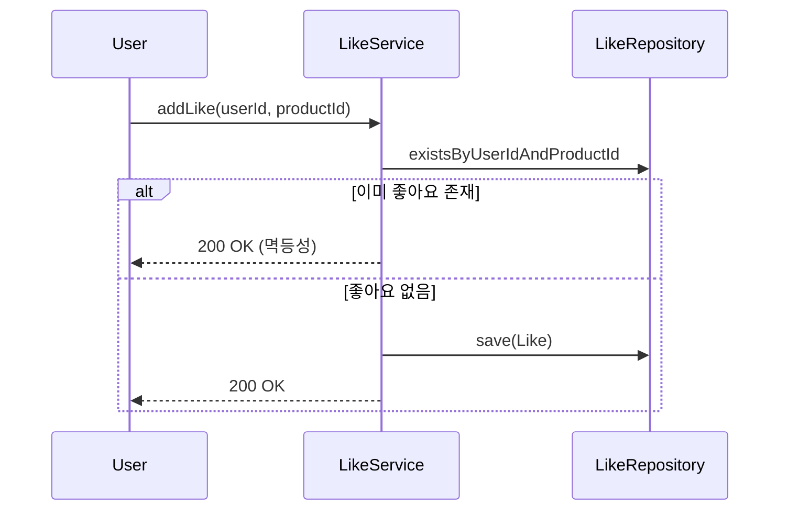
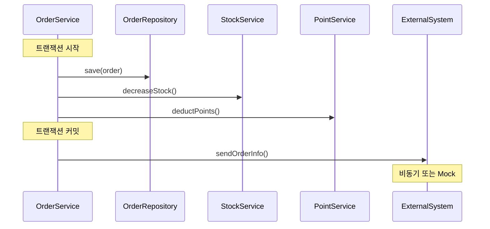

# 이커머스 설계, 멱등성과 동시성 제어를 고민하다

**TL;DR**: 이커머스 시스템 설계 과정에서 좋아요 기능의 멱등성, 주문 생성 시 트랜잭션 범위, 재고 차감의 동시성 제어, 도메인 객체의 책임 분리에 대해 고민했습니다. 단순히 "어떻게 구현할지"가 아니라 "왜 그렇게 설계했는지"를 중심으로 정리한 글입니다.

## 왜 이 글을 쓰게 되었나?

2주차 과제로 이커머스 시스템의 상품, 브랜드, 좋아요, 주문 도메인 설계를 완료했습니다. ERD부터 클래스 다이어그램, 시퀀스 다이어그램까지 작성하면서 "기능만 돌아가면 되는 거 아닌가?"라는 생각에서 벗어나, 실제 서비스에서 발생할 수 있는 문제들을 마주하게 되었습니다.

특히 좋아요를 중복으로 누르면 어떻게 처리할지, 동시에 주문이 들어오면 재고가 음수가 될 수 있는지, 주문 생성 중 외부 시스템 연동이 실패하면 어디까지 롤백해야 하는지... 이런 질문들이 설계 과정 내내 저를 따라다녔습니다.

"일단 돌아가게 만들고 나중에 고치면 되지"라는 생각이 들 때마다, 처음부터 제대로 고민하지 않으면 나중에 더 큰 대가를 치를 수 있다는 걸 깨달았습니다.

## 문제 1: 좋아요를 두 번 누르면?

### 문제 발견

사용자가 상품에 좋아요를 누를 수 있는 기능을 설계하면서 가장 먼저 마주한 문제는 "좋아요를 두 번 누르면 어떻게 되지?"였습니다.

처음엔 단순하게 생각했습니다. 좋아요 테이블에 user_id와 product_id를 저장하면 되니까, 중복으로 INSERT만 안 되게 막으면 끝이라고요. 하지만 요구사항을 다시 읽어보니 **"멱등하게 동작해야 한다"**는 조건이 있었습니다.

멱등성이란 같은 요청을 여러 번 보내도 결과가 동일해야 한다는 의미입니다. 즉, 좋아요를 이미 누른 상품에 다시 좋아요를 요청해도 에러가 아닌 성공 응답을 줘야 합니다.

### 다양한 시도

두 가지 방법을 고민했습니다:

#### 방법 1: DB 유니크 제약에 의존

```kotlin
// DB에 (user_id, product_id) 유니크 제약을 걸고
// 중복 INSERT 시도 시 DuplicateKeyException 발생
// 이를 catch해서 200 OK 반환

try {
    likeRepository.save(Like(userId, productId))
} catch (e: DuplicateKeyException) {
    // 이미 좋아요했으므로 성공으로 처리
    return success()
}
```

#### 방법 2: 사전에 존재 여부 확인

```kotlin
// 좋아요가 이미 있는지 먼저 확인
if (!likeRepository.existsByUserIdAndProductId(userId, productId)) {
    likeRepository.save(Like(userId, productId))
}
// 이미 있든 없든 성공 응답
return success()
```

### 선택한 방식과 이유

방법 2를 선택했습니다.

방법 1은 예외를 제어 흐름에 사용하는 Anti-pattern입니다. 정상적인 시나리오(이미 좋아요한 경우)를 예외로 처리하는 건 코드의 의도를 흐리게 만들고, 성능상으로도 예외 생성 비용이 있습니다.

방법 2는 명시적으로 "이미 좋아요했는지 확인하고, 없으면 추가한다"는 의도가 드러납니다. 물론 확인과 저장 사이의 Race Condition이 있지만, DB의 유니크 제약이 최종 방어선 역할을 해줍니다.



### 배운 점

멱등성은 단순히 "중복 방지"가 아니라 **"같은 요청을 반복해도 안전하다"**는 보장입니다. 사용자가 네트워크 오류로 재시도 버튼을 누르든, 실수로 두 번 클릭하든, 시스템은 예측 가능하게 동작해야 합니다.

좋아요 취소도 마찬가지입니다. 이미 취소된 좋아요를 다시 취소해도 에러가 아닌 성공을 반환하도록 설계했습니다. API 설계는 개발자가 아닌 사용자 입장에서 생각해야 한다는 걸 다시 한번 깨달았습니다.

## 문제 2: 재고가 음수가 된다면?

### 문제 발견

주문 생성 기능을 설계하면서 가장 신경 쓴 부분은 재고 차감 로직이었습니다.

```kotlin
// 이렇게만 하면 안 됩니다
val stock = stockRepository.findByProductId(productId)
if (stock.quantity >= orderQuantity) {
    stock.quantity -= orderQuantity
    stockRepository.save(stock)
}
```

두 명의 사용자가 동시에 마지막 1개 남은 상품을 주문하면 어떻게 될까요? 둘 다 재고 확인을 통과하고, 재고가 -1이 될 수 있습니다. 이건 데이터 정합성을 깨뜨리는 심각한 문제입니다.

### 다양한 시도

세 가지 방법을 고민했습니다:

#### 방법 1: 비관적 락 (Pessimistic Lock)

```sql
SELECT * FROM stocks WHERE product_id = ? FOR UPDATE;
-- 트랜잭션 종료까지 다른 트랜잭션은 대기
```

장점: 확실하게 동시성 문제 해결
단점: 대기 시간 증가, 데드락 위험, 성능 저하

#### 방법 2: 낙관적 락 (Optimistic Lock)

```kotlin
@Entity
class Stock(
    val productId: Long,
    var quantity: Int,
    @Version var version: Int = 0  // JPA가 자동으로 증가
)

// 업데이트 시 version을 확인
UPDATE stocks
SET quantity = ?, version = version + 1
WHERE product_id = ? AND version = ?
```

장점: 충돌이 적으면 성능 우수
단점: 충돌 시 재시도 로직 필요

#### 방법 3: Redis 분산 락

장점: 분산 환경에서도 동작
단점: Redis 추가 필요, 인프라 복잡도 증가

### 선택한 방식과 이유

낙관적 락을 선택했습니다.

이커머스에서 동일 상품에 대한 동시 주문 충돌은 생각보다 드뭅니다. 대부분의 경우는 충돌 없이 성공하고, 간혹 발생하는 충돌은 재시도로 해결할 수 있습니다.

비관적 락은 "항상 충돌이 일어날 것"이라고 가정하고 모든 요청을 직렬화합니다. 하지만 충돌이 드문 상황에서는 불필요하게 성능을 희생하는 셈입니다.

```kotlin
// 낙관적 락 + 재시도 전략
@Retryable(
    maxAttempts = 3,
    backoff = Backoff(delay = 100)
)
fun decreaseStock(productId: Long, quantity: Int) {
    val stock = stockRepository.findById(productId)
        .orElseThrow { ProductNotFoundException() }

    if (!stock.isAvailable(quantity)) {
        throw InsufficientStockException()
    }

    stock.decrease(quantity)  // version이 자동으로 증가
    stockRepository.save(stock)  // version 불일치 시 OptimisticLockException
}
```

ERD 설계에도 이를 반영했습니다:

```sql
CREATE TABLE stocks (
    product_id BIGINT PRIMARY KEY,
    quantity INT NOT NULL DEFAULT 0 CHECK (quantity >= 0),
    version INT NOT NULL DEFAULT 0,  -- 낙관적 락용
    updated_at TIMESTAMP NOT NULL DEFAULT CURRENT_TIMESTAMP
);
```

### 배운 점

동시성 제어는 "무조건 락을 걸면 안전하다"가 아니라 **"어떤 락이 이 시스템에 적합한가"**를 고민해야 합니다.

충돌 빈도가 높다면 비관적 락이, 낮다면 낙관적 락이 유리합니다. 분산 환경이라면 Redis 락도 고려해야 하고요. 트레이드오프를 이해하고 선택하는 것이 설계의 핵심이라는 걸 배웠습니다.

## 문제 3: 주문 생성, 어디까지 하나의 트랜잭션으로?

### 문제 발견

주문 생성은 여러 단계를 거칩니다:

1. 주문 정보 저장
2. 재고 차감
3. 포인트 차감
4. 외부 시스템에 주문 정보 전송

1~3번은 당연히 하나의 트랜잭션이어야 합니다. 재고는 차감됐는데 주문은 저장 안 되면 큰일이니까요. 하지만 4번 외부 시스템 연동은 어떻게 해야 할까요?

### 다양한 시도

#### 방법 1: 모두 하나의 트랜잭션

```kotlin
@Transactional
fun createOrder(...) {
    // 1. 주문 저장
    // 2. 재고 차감
    // 3. 포인트 차감
    // 4. 외부 시스템 연동  <- 실패하면 전부 롤백
}
```

외부 시스템이 느리거나 실패하면? 트랜잭션이 길어지고, 최악의 경우 전부 롤백됩니다.

#### 방법 2: 외부 연동은 트랜잭션 밖

```kotlin
@Transactional
fun createOrder(...): Order {
    // 1. 주문 저장
    // 2. 재고 차감
    // 3. 포인트 차감
    return order
}

// 트랜잭션 커밋 후
fun afterCommit(order: Order) {
    // 4. 외부 시스템 연동 (실패해도 롤백 안 됨)
}
```

외부 연동이 실패하면? 주문은 저장됐지만 외부 시스템은 모릅니다. 재시도 또는 보상 트랜잭션이 필요합니다.

#### 방법 3: 이벤트 기반 비동기 처리

```kotlin
@Transactional
fun createOrder(...) {
    // 1~3 처리
    eventPublisher.publish(OrderCreatedEvent(order))
}

@EventListener
fun onOrderCreated(event: OrderCreatedEvent) {
    // 4. 외부 시스템 연동 (비동기)
}
```

### 선택한 방식과 이유

방법 2를 선택했습니다.

외부 시스템 연동은 우리가 제어할 수 없는 영역입니다. 느릴 수도, 실패할 수도 있죠. 이를 트랜잭션 안에 넣으면 전체 주문 처리가 외부 시스템에 종속됩니다.

대신 트랜잭션 커밋 후 외부 연동을 시도하고, 실패하면 재시도하거나 관리자에게 알림을 보내는 방식으로 설계했습니다. 최악의 경우 수동으로 보정할 수 있는 여지를 남겨둔 거죠.

시퀀스 다이어그램에도 이를 명확히 표현했습니다:



### 배운 점

트랜잭션 범위는 **"꼭 함께 성공하거나 실패해야 하는 것"**만 묶어야 합니다.

외부 시스템 연동을 트랜잭션에 넣으면 안전해 보이지만, 실제로는 성능과 가용성을 해칩니다. 대신 실패 시나리오를 명확히 정의하고, 재시도나 보상 처리를 통해 최종 일관성(Eventual Consistency)을 보장하는 것이 현실적인 설계라는 걸 배웠습니다.

## 문제 4: 도메인 객체는 어디까지 책임져야 하나?

### 문제 발견

클래스 다이어그램을 그리면서 "재고 차감 로직을 어디에 둘까?"를 고민했습니다.

#### 안티패턴: Service에 모든 로직

```kotlin
class OrderService {
    fun createOrder(...) {
        val stock = stockRepository.findById(productId)
        if (stock.quantity < orderQuantity) {
            throw InsufficientStockException()
        }
        stock.quantity -= orderQuantity
        stockRepository.save(stock)
    }
}
```

이렇게 하면 Stock은 그냥 데이터 덩어리입니다. 비즈니스 로직이 Service에 흩어져 있죠.

### 선택한 방식

도메인 객체가 자신의 로직을 책임지도록 설계했습니다:

```kotlin
class Stock(
    val productId: Long,
    private var quantity: Int
) {
    fun isAvailable(requestQuantity: Int): Boolean {
        return quantity >= requestQuantity
    }

    fun decrease(requestQuantity: Int) {
        if (!isAvailable(requestQuantity)) {
            throw InsufficientStockException()
        }
        quantity -= requestQuantity
    }

    fun increase(requestQuantity: Int) {
        quantity += requestQuantity
    }
}
```

이제 Service는 도메인 객체를 조율하기만 하면 됩니다:

```kotlin
class OrderService {
    fun createOrder(...) {
        val stock = stockRepository.findById(productId)
        stock.decrease(orderQuantity)  // 책임을 Stock에게 위임
        stockRepository.save(stock)
    }
}
```

Price, Money 같은 Value Object도 마찬가지입니다:

```kotlin
data class Money(
    val amount: BigDecimal,
    val currency: Currency
) {
    fun add(other: Money): Money {
        require(currency == other.currency)
        return Money(amount + other.amount, currency)
    }

    fun multiply(multiplier: Int): Money {
        return Money(amount * multiplier.toBigDecimal(), currency)
    }
}
```

### 배운 점

**"데이터와 로직은 함께 있어야 한다"**는 객체지향의 기본 원칙을 다시 깨달았습니다.

Stock은 단순히 quantity를 저장하는 게 아니라, "재고를 안전하게 관리하는 책임"을 가진 객체입니다. Service에 로직을 두면 Stock을 쓰는 모든 곳에서 동일한 검증 로직을 반복하게 되고, 빼먹으면 버그가 됩니다.

도메인 객체에 로직을 넣으니 테스트도 쉬워졌습니다. Service를 띄우지 않고도 Stock 단위로 테스트할 수 있으니까요.

## 회고: 설계는 정답이 아닌 판단의 연속

이번 설계 과정에서 가장 많이 한 질문은 "왜?"였습니다.

- 왜 멱등성이 필요한가?
- 왜 낙관적 락을 선택했는가?
- 왜 외부 연동은 트랜잭션 밖에 뒀는가?
- 왜 도메인 객체에 로직을 넣었는가?

모든 결정에는 트레이드오프가 있었고, "이게 무조건 정답이다"라는 건 없었습니다. 대신 "이 상황에서는 이게 더 나은 선택이다"라는 판단을 내렸습니다.

처음엔 ERD만 그려도 설계가 끝난 줄 알았습니다. 하지만 멱등성, 동시성, 트랜잭션 범위, 책임 분리... 이런 고민들을 하나씩 해결하면서, 설계는 **"어떻게"가 아니라 "왜"를 고민하는 과정**이라는 걸 배웠습니다.

다음 구현 단계에서는 이 설계가 실제 코드로 어떻게 녹아드는지, 설계와 구현 사이의 간극은 어떻게 메꿔가는지 경험하고 싶습니다. 그리고 그 과정에서 또 어떤 "왜?"를 마주하게 될지 기대됩니다.

---

## 이 글에서 다룬 주요 개념

- 멱등성(Idempotency) 설계
- 낙관적 락 vs 비관적 락
- 트랜잭션 범위와 최종 일관성
- 도메인 주도 설계(DDD)의 책임 분리
- Value Object와 Entity의 차이
